# Journal Folder

An Obsidian community plugin that turns *any* folder in your vault into a journal. Drop a note named `2026-05-04.md` (or `2026-W19.md`, `2026-05.md`, `2026.md`) into a folder, add a one-line code block at the top, and the plugin renders a navigable header — backward/forward chips, a *Today* link, a *More…* popover with higher-order period jumps, and an optional inline calendar picker.

You can run as many independent journals as you like in the same vault. A folder per project, a folder for personal notes, a folder per client — each gets its own settings, its own sequence of notes, and its own header.

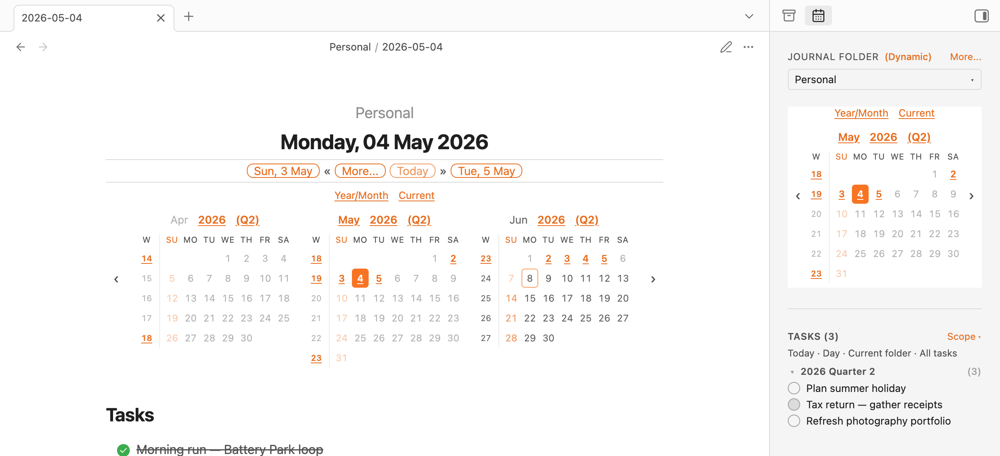

---

## Why folder-based?

Most journaling plugins assume one global daily-notes folder. *Journal Folder* assumes nothing about *where* journals live or *how many* you keep. Conventions that hold:

- A note's basename is its date. Filename formats are fixed; everything else (title, link labels, calendar visibility, folder title) is configurable.
- Settings cascade from global → folder → embedded. Per-folder overrides go in `journal-folder.md`; per-header overrides go in the body of the code block.
- The plugin only acts on files matching the date conventions, so the rest of the folder's contents are ignored.

The vault root is **not** supported as a journal folder — Obsidian's link resolution behaves differently there.

## Recognised file names

| Note type | Filename format | Example |
| --- | --- | --- |
| Daily     | `YYYY-MM-DD` | `2026-05-04.md` |
| Weekly    | `gggg-[W]ww` | `2026-W19.md`   |
| Monthly   | `YYYY-MM`    | `2026-05.md`    |
| Yearly    | `YYYY`       | `2026.md`       |

The weekly format uses ISO week-year (`gggg`/`gg`). If you customise weekly title patterns, use `gg`/`gggg` for the year — `YYYY` or `GGGG` will desync the displayed year from the filename around year boundaries.

A fifth tier — quarterly notes (`YYYY-Q[1-4]`) — is available as an opt-in. See [*Quarterly notes (opt-in)*](#quarterly-notes-opt-in) below.

## Install

The plugin is published to the Obsidian community plugin directory under the name **Journal Folder**. Open *Settings → Community plugins → Browse*, search for it, install, and enable.

To run from source, clone this repo and:

```bash
npm install
npm run build      # tsc --noEmit + production esbuild → main.js
```

Copy `main.js`, `manifest.json`, and `styles.css` into `<vault>/.obsidian/plugins/journal-folder/`.

---

## The journal header

Every journal note gets a header by including a `journal-header` code block at the top:

````markdown
%% EDITING %%
```journal-header
```
````

That's it. The plugin replaces the code block with a rendered header keyed off the note's filename. The leading `%% EDITING %%` comment is optional but recommended — without it, opening a note in edit mode lands the cursor on the code block, which causes the rendered header to flicker into source until you click away. With the comment, the cursor lands on the comment line first; reading view drops the comment entirely and renders the header at the very top.

> [!TIP]
> Use the [Templater](https://silentvoid13.github.io/Templater/) plugin (or the core *Templates* plugin) to inject this block automatically into new notes in each journal folder.

### What the header shows

#### Daily note

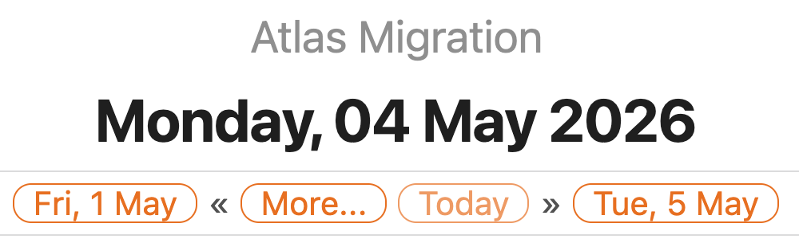

The primary row shows: backward chip, **More…** button, *Today* (only if the note isn't today), forward chip. The folder title at the top is optional (see *Folder title* below).

- **Backward link** — closest existing earlier daily note, or the note for the previous day if it doesn't exist yet but the date is today/future. Otherwise omitted.
- **Forward link** — symmetric: closest existing later daily note, or the next day if today/future.
- **Today** — links to today's daily note; only shown when the current note isn't today.
- **More…** — opens the popover (next section).

#### Weekly note

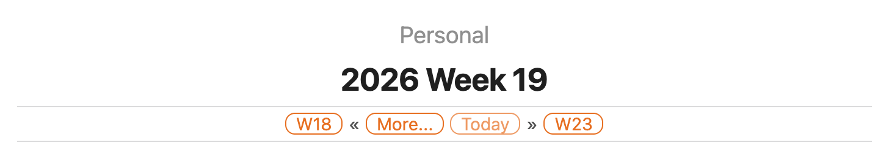

Backward/forward chips become weeks; *Today* always renders.

#### Monthly note


Backward/forward chips become months; *Today* always renders.

#### Yearly note

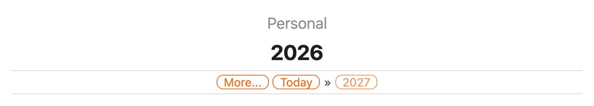

Backward/forward chips become years; *Today* always renders.

#### Without a folder title

If no folder title is configured, the row above the H1 is simply omitted:

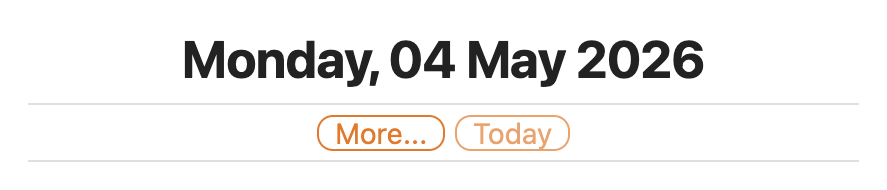

### The More popover

The chips on the primary row are deliberately minimal. Higher-order period jumps and lower-order period lists live in the *More…* popover so the bar stays uncluttered.

#### From a daily note

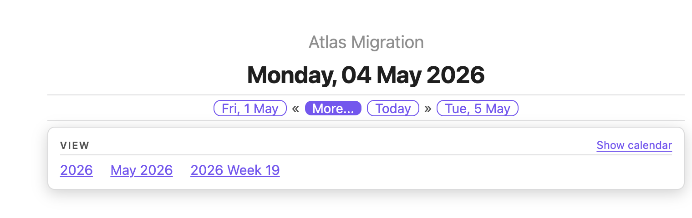

The **Jump to** section lists higher-order periods that contain the current note: year (`2026`), month (`May`), week (`W19`). For unspanning periods each link is shown only if a note exists for that period or if the period is current/future; when the current note straddles a tier boundary (e.g. a week that crosses March/April) all overlapping periods are listed, with past+missing entries rendered inactive. The **Show calendar** / **Hide calendar** toggle on the right opens or closes the inline calendar picker (see next section).

#### From a weekly note

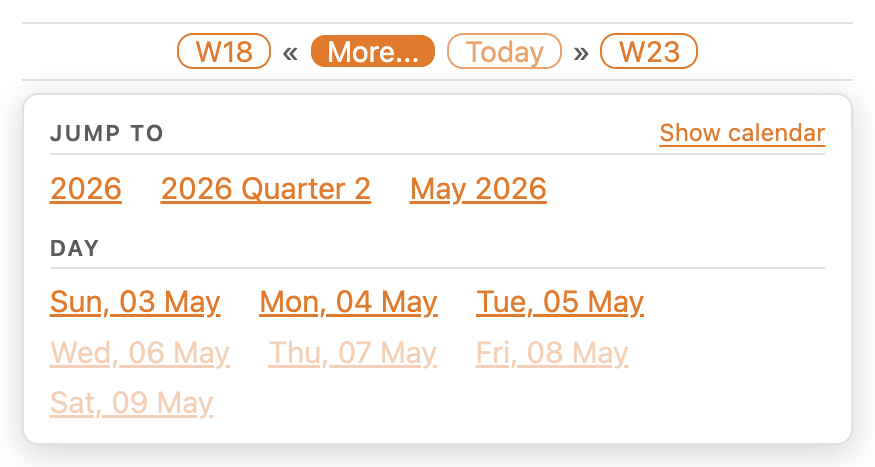

A weekly note also exposes a **Day** section listing each day in the week, with the same exists/present/future filter applied to each link.

#### From a monthly note

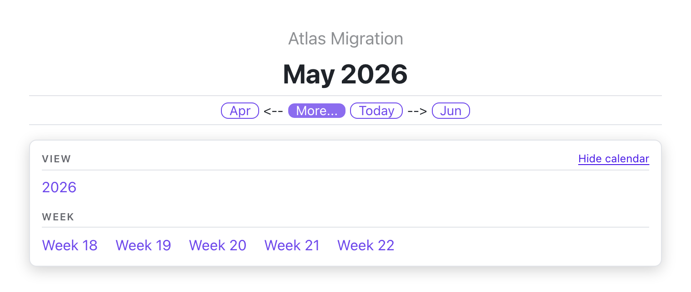

A monthly note's lower-order section is **Week**; a yearly note's is **Month**. On yearly notes the *Jump to* section is empty (no higher-order periods exist), so the calendar toggle moves to the *Month* header on the right. The toggle reads *Hide calendar* here because the calendar is currently visible.

### The calendar picker

Toggle the calendar from the More popover and the inline picker appears below the header. It reflects the same exists/missing/today/current state the rest of the plugin uses, so you can see your whole journal at a glance:

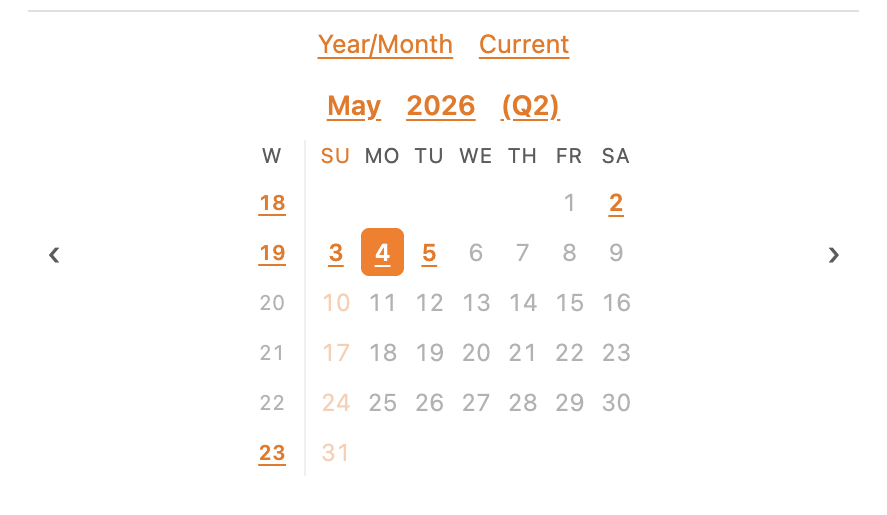

Cell rules (apply uniformly across day/week/month/year cells):

- **Missing** — theme's normal text colour, faded at the theme's unresolved-link opacity. Past missing cells are faded an additional 50% so they read as more demoted than future missing cells. Clicking a past missing cell opens a confirmation modal before creating the note (so you don't accidentally create back-dated entries).
- **Existing** — accent colour, bold, underlined.
- **Sundays** — accent colour across every state (existing, future-missing, past-missing) and on the weekday header, so the start of the week is always easy to pick out.
- **Today** — accent ring around the cell.
- **Current note** — filled accent background. Travels with the note's time unit, so opening a monthly note paints the *month* cell, not the day:

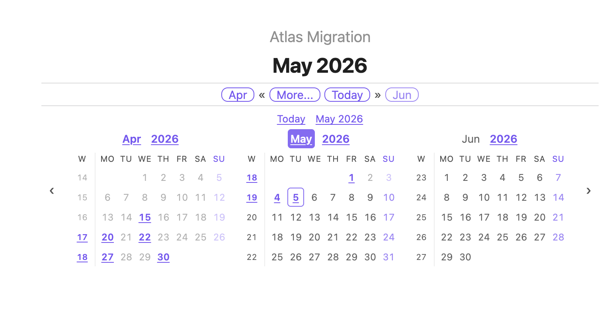

Clicking a date that doesn't yet have a note creates it (with a confirm prompt for past dates). Arrows on the sides slide the visible month window by one month at a time.

The strip above the months grid carries up to three quick-nav controls. **Year/Month** (always shown) toggles a date-picker popover with year chevrons (`‹` and `›` shift by ±12 months) and a 4×3 grid of month names; clicking a month jumps the window straight to it. The picker is portaled and clamped inside the viewport, so it doesn't overflow at narrow widths. **Current** appears only when the visible window has scrolled away from today's month — clicking it snaps back. **Note month** appears only when the visible window has scrolled away from the host note's own month, and only differs from *Current* once you start a session on a non-today note. Both *Current* and *Note month* hide themselves when they'd be redundant, so the chrome quietly disappears as you navigate back into range.

The number of visible months is chosen automatically based on the available width, capped at 5. As the pane narrows the picker drops to a single month; on mobile the cells additionally enlarge for easier tapping:

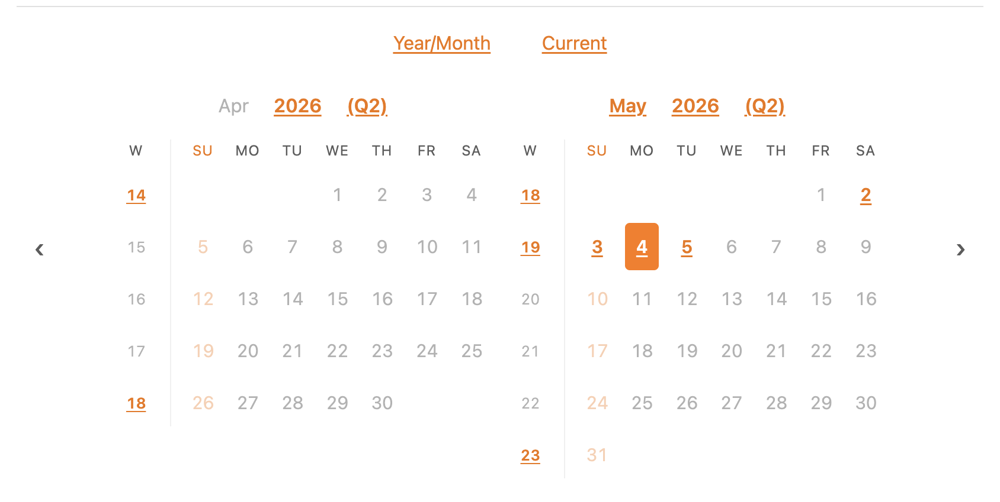

You can have the calendar open by default for new sessions — see `default-calendar-visible-desktop` and `default-calendar-visible-mobile` under *Configuration*. The two platforms have independent defaults (calendar on for desktop, off for mobile) because the multi-month layout isn't useful at phone widths. A manual toggle from the More popover wins over any default for the rest of the running Obsidian session, so navigating between folders with different defaults won't override an explicit choice.

---

## Sidebar tab

A dedicated sidebar view collects journal-folder actions in one place. Open it with the calendar ribbon icon (left edge of the workspace) — the view docks in the right sidebar by default.

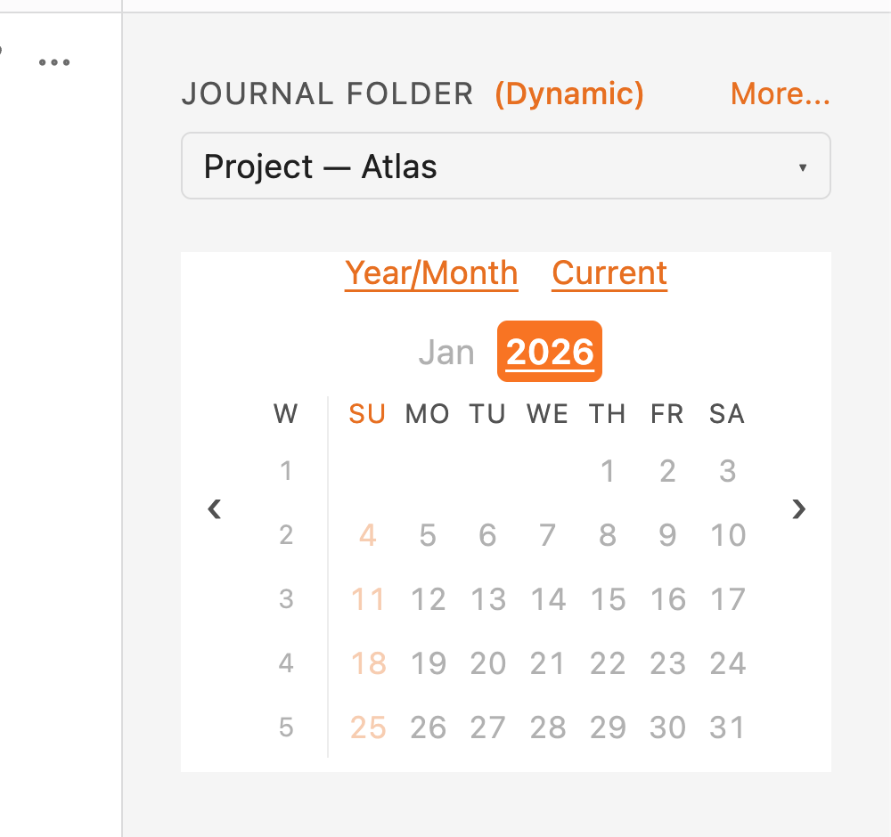

The header reads **JOURNAL FOLDER (Dynamic)** or **JOURNAL FOLDER (Static)** — the parenthesised tag tracks the current mode at a glance. A single **More...** link to the right of that label opens every secondary action; the folder picker beneath it switches between known journal folders.

### Folder picker

Every folder that contains a `journal-folder.md` shows up in the picker. Click the dropdown trigger and Obsidian's native menu lists them all:

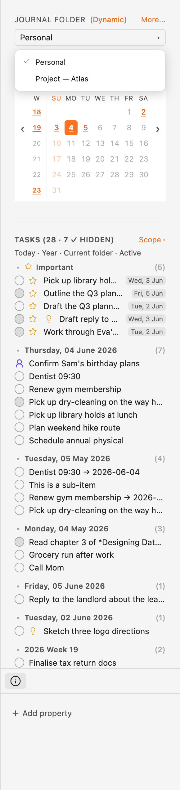

In **dynamic** mode (the default), opening a journal note in a different folder switches the picker automatically — the calendar scrolls to that note's period and highlights its cell. In **static** mode the picker holds whichever folder you chose regardless of which note is open. Persists as the global `sidebar-mode` setting.

### Calendar

The calendar is the same single-month grid logic the in-note calendar uses, scoped to the selected folder. Clicking a day, week, month, quarter, or year cell opens (or creates) the corresponding journal note; past-dated cells with no existing note route through the same *Create missing note?* confirmation prompt the in-note calendar uses. The controls strip carries the same **Year/Month**, **Current**, and **Note month** quick-nav links as the in-note calendar, plus `‹` / `›` arrows for month-by-month navigation. In dynamic mode the calendar scrolls to follow the active note's period without clearing your manual `‹` / `›` history.

### More... menu

A single text link to the right of the section header opens an Obsidian-native menu with every secondary action. The menu is built from the current sidebar state, so options that don't apply right now are simply omitted (e.g. *Switch to default folder* is hidden when you're already on the default; *Edit folder configuration* is hidden when no journal folder is selected).

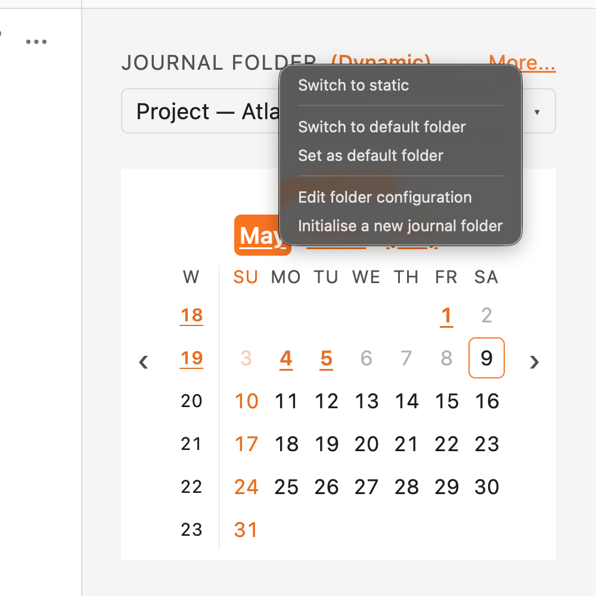

Items:

- **Switch to dynamic / Switch to static** — flips the mode (also reflected in the section-header tag). Persists as the global `sidebar-mode` setting.
- **Switch to default folder** — resets the picker to the configured `default-journal-folder`. Shown only when you're on a non-default folder *and* the configured default still exists in the known list.
- **Set as default folder** — promotes the currently selected folder to the new global default. Shown only when the picker is on a non-default journal folder. The default folder itself has no global-settings-tab UI — set it from here.
- **Edit folder configuration** — opens a modal containing the same form rows as the plugin settings tab, but writing to the selected folder's `journal-folder.md` front matter instead of the plugin's `data.json`. Global-only fields (`start-of-week`, `hide-journal-folder-notes`, the *Sidebar* section, the destructive *Reset all* button) are hidden. Per-folder fields show their **effective** value (global merged with the folder's existing front matter), and edits are stored sparsely — fields that match the global config are *removed* from the front matter so subsequent global edits keep flowing through, while diverging fields are written as kebab-cased keys.
- **Initialise a new journal folder** — opens a fuzzy folder picker showing every folder that *isn't* already a journal folder (the vault root is excluded — it's not a supported journal folder elsewhere in the plugin). Picking a folder creates a `journal-folder.md` in it seeded with `journal-folder-title: <folder name>`, then switches the sidebar's selected folder to the new one.

### Hiding the config notes

`journal-folder.md` files are hidden from Obsidian's file tree by default — the **Hide `journal-folder.md` in file explorer** toggle in the plugin settings tab. They remain on disk and remain reachable through search and the *Edit folder configuration* action above; the *Edit folder configuration* form is the preferred way to change per-folder settings, so most users never need to see the raw config note. Turn the toggle off if you'd rather hand-edit the front matter directly in the file tree.

---

## Configuration

Settings are resolved in three layers, **last wins**:

1. **Global** — set in *Settings → Community plugins → Journal Folder*. Persists in `data.json`.
2. **Folder** — front-matter of a file named `journal-folder.md` in the same folder as the journal note. Subfolders never inherit from a parent folder's `journal-folder.md` — each folder controls its own settings.
3. **Embedded** — body of the current `journal-header` code block, parsed line-by-line as `key: value`. Applies only to that one header.

Setting names are case-insensitive and tolerant of separators. All of the following are equivalent:

```
journal-folder-title: Atlas Migration
journal_folder_title: Atlas Migration
JOURNAL_FOLDER_TITLE: Atlas Migration
Journal folder title: Atlas Migration
```

### Folder-level overrides

> [!TIP]
> The recommended way to edit per-folder settings is the **sidebar tab → More… → *Edit folder configuration*** action. It opens a form pre-populated with the effective values, validates as you go, and writes a sparse diff to `journal-folder.md` so the folder still inherits future global changes for any field you didn't deliberately diverge on. See [Sidebar tab](#sidebar-tab) for the entry point.

Under the hood, per-folder overrides live in the front matter of a file named `journal-folder.md` inside the journal folder. The sidebar UI is the easiest way to edit it; you *can* hand-edit the front matter directly if you prefer:

```markdown
---
journal-folder-title: Atlas Migration
default-calendar-visible-desktop: true
default-calendar-visible-mobile: false
daily-note-title-pattern: dddd, Do MMMM YYYY
---
```

By default `journal-folder.md` is hidden from Obsidian's file explorer (see `hide-journal-folder-notes` below). It's still reachable via search and through the sidebar's *Edit folder configuration* action.

> [!CAUTION]
> Anything set at folder level applies to every journal header in that folder, but does *not* affect the actual folder name on disk. `journal-folder-title` is a display label only.

> [!NOTE]
> The **body** of `journal-folder.md` is no longer ignored. When *Auto-fill new journal notes* is enabled, a non-empty body is used as the template seeded into new daily/weekly/monthly/quarterly/yearly notes in this folder — see [Auto-fill new journal notes](#auto-fill-new-journal-notes).

### Per-header overrides (embedded config)

Settings inside a code block override both global and folder settings — but only for that single header:

````markdown
%% EDITING %%
```journal-header
default-calendar-visible-desktop: true
daily-note-title-pattern: dddd, Do MMMM YYYY
```
````

### Settings reference

All title patterns use [moment.js format syntax](https://momentjs.com/docs/#/displaying/format/).

| Setting | What it does |
| --- | --- |
| `daily-note-title-pattern`           | H1 title pattern for daily notes. Don't include sub-day units (hours, minutes). |
| `daily-note-short-title-pattern`     | Pattern used for chips/links pointing to daily notes. Keep it short — multiple chips render side by side. |
| `daily-note-medium-title-pattern`    | Pattern for daily-note links whose target is in a different year than the source — typically the short pattern plus the year, so the year change is explicit. |
| `weekly-note-title-pattern`          | H1 title pattern for weekly notes. **Use `gg`/`gggg` for the year**, not `YYYY`/`GGGG` — the filename uses ISO week-year and they desync at year boundaries. |
| `weekly-note-short-title-pattern`    | Chip/link pattern for weekly notes. Same `gg`/`gggg` caveat. |
| `weekly-note-medium-title-pattern`   | Cross-year weekly link pattern. Same caveat. |
| `monthly-note-title-pattern`         | H1 title pattern for monthly notes. Don't include sub-month units. |
| `monthly-note-short-title-pattern`   | Chip/link pattern for monthly notes. |
| `monthly-note-medium-title-pattern`  | Cross-year monthly link pattern. |
| `yearly-note-title-pattern`          | H1 title pattern for yearly notes. Don't include sub-year units. |
| `yearly-note-short-title-pattern`    | Chip/link pattern for yearly notes. |
| `yearly-note-medium-title-pattern`   | Cross-year yearly link pattern (rare; usually identical to short). |
| `journal-folder-title`               | Display title shown above the H1 in the header. Typically set per-folder, not globally. |
| `use-folder-name-as-default-title`   | If true and `journal-folder-title` isn't set, falls back to the folder name. |
| `default-calendar-visible-desktop`   | If true, the calendar picker is open by default on desktop when Obsidian starts. A manual toggle in the current session wins over this. |
| `default-calendar-visible-mobile`    | If true, the calendar picker is open by default on mobile when Obsidian starts. Defaults to false because the multi-month layout isn't useful at phone widths. |
| `start-of-week`                      | First day of the week used by the calendar grid and `gggg-[W]ww` weekly numbering. *Locale default* leaves moment's locale untouched; picking an explicit weekday (`sunday`–`saturday`) overrides it so week 1 still contains January 1. **Global only** — moment's locale is process-wide, so per-folder and embedded overrides are ignored to avoid inconsistent week numbering across the vault. |
| `auto-template-enabled`              | If true, newly created notes whose basename matches a journal pattern and whose folder contains a `journal-folder.md` are seeded with a template body. Override per-folder by setting `auto-template-enabled: false` in that folder's `journal-folder.md` front matter. See [Auto-fill new journal notes](#auto-fill-new-journal-notes). |
| `auto-template-per-tier`             | If false (default), every new journal note shares `auto-template-content`. If true, the per-tier fields below are used instead, one per note type. The two modes are mutually exclusive — only the fields that match the current mode are consulted. |
| `auto-template-content`              | Single template body used when `auto-template-per-tier` is **off**. Leave blank for the built-in default (a `journal-header` code block, prefixed with the `%% JOURNAL NOTE %%` Obsidian comment). Per-folder overrides go in the body of `journal-folder.md` — see below. |
| `daily-note-auto-template-content`     | Template body used for **new daily notes** (`YYYY-MM-DD`) when `auto-template-per-tier` is **on**. Leave blank for the built-in default. |
| `weekly-note-auto-template-content`    | Template body used for **new weekly notes** (`gggg-[W]ww`) when `auto-template-per-tier` is **on**. Leave blank for the built-in default. |
| `monthly-note-auto-template-content`   | Template body used for **new monthly notes** (`YYYY-MM`) when `auto-template-per-tier` is **on**. Leave blank for the built-in default. |
| `quarterly-note-auto-template-content` | Template body used for **new quarterly notes** (`YYYY-Q[1-4]`) when `auto-template-per-tier` is **on**. Only consulted when `quarters-enabled` is also on. Leave blank for the built-in default. |
| `yearly-note-auto-template-content`    | Template body used for **new yearly notes** (`YYYY`) when `auto-template-per-tier` is **on**. Leave blank for the built-in default. |
| `default-journal-folder`             | Folder path the **sidebar tab** opens on by default. The sidebar's *Switch to default* action resets the selected folder to this value. Empty string means "no default chosen" — the sidebar then falls back to the first detected journal folder. **Global only** — this is a UI preference, not a per-folder concept. |
| `hide-journal-folder-notes`          | If true (the default), every `journal-folder.md` is hidden from Obsidian's built-in file explorer. The notes still exist on disk and remain accessible via search and the sidebar's *Edit folder configuration* action. Set to false if you'd rather see and edit the config note directly in the file tree. **Global only**. |
| `sidebar-mode`                       | `'dynamic'` (default) makes the sidebar follow the active note when it lives in a journal folder; `'static'` holds whichever folder you picked regardless of which note is open. **Global only** because the sidebar is a singleton view; toggle it from inside the sidebar itself. |

### Folder title resolution

The header's folder-title row is resolved as:

1. If `journal-folder-title` is configured (folder or embedded), use it.
2. Else if `use-folder-name-as-default-title` is true, use the folder's actual name.
3. Else omit the row entirely.

---

## Auto-fill new journal notes

The plugin can seed new journal notes with a template body, so you don't need Templater (or another helper plugin) just to drop a `journal-header` code block at the top of every new note.

### Enabling

Off by default. Turn it on at any of two layers:

- **Globally** in *Settings → Community plugins → Journal Folder → Auto-fill new journal notes*.
- **Per folder** by adding `auto-template-enabled: true` (or `false` to disable) to that folder's `journal-folder.md` front matter.

When enabled, a new note is auto-filled only when **all** of these are true:

1. The note's basename matches a journal file pattern (`YYYY-MM-DD`, `gggg-[W]ww`, `YYYY-MM`, `YYYY-Q[1-4]` when quarters are enabled, or `YYYY`).
2. The folder containing the note has a `journal-folder.md` config file.
3. The note is empty at creation (existing content is never overwritten).

### One template, or one per note type?

A toggle in the plugin settings — *Use a different template per note type* — selects between the two modes. They are **mutually exclusive**: only one is in effect at a time.

- **Off** (default) — every new journal note (daily, weekly, monthly, quarterly, yearly) is seeded with the same *Default template*. The per-tier fields are hidden and ignored.
- **On** — pick a separate template for each note type via the *Daily / Weekly / Monthly / Quarterly / Yearly note template* fields. The generic *Default template* is hidden and ignored. A blank tier-specific field falls through to the built-in default rather than to the generic template.

The toggle is persisted as `auto-template-per-tier` and can be overridden per-folder in `journal-folder.md`.

### Template precedence

The template body is resolved in three layers, **first non-empty wins**:

1. **Per-folder body** — the markdown body of `journal-folder.md` (everything below its front matter). Use this when one folder needs a different template than the rest of the vault. Applies to every tier in that folder regardless of the toggle.
2. **Global setting** — depends on the toggle:
   - Toggle off: *Default template* (`auto-template-content`).
   - Toggle on: the matching *…note template* field for the new note's tier (`{daily,weekly,monthly,quarterly,yearly}-note-auto-template-content`).
3. **Built-in default** — `%% JOURNAL NOTE %%` followed immediately by an empty `journal-header` code block (no blank line between them, so the comment sits flush with the fence).

The `%% … %%` line is an Obsidian hidden comment — it doesn't render in reading mode and parks the cursor above the code block when toggling into edit mode. Without it, the cursor lands inside the fence and the block stops rendering until you click out.

### Different templates for different note types

Flip the *Use a different template per note type* toggle on (or set `auto-template-per-tier: true` per-folder) and the per-tier fields apply. For example, to give a folder a checklist for daily notes and a review prompt for weekly notes — while leaving monthly and yearly notes on the built-in default:

```markdown
---
auto-template-enabled: true
auto-template-per-tier: true
daily-note-auto-template-content: |
  %% JOURNAL NOTE %%
  ```journal-header
  ```

  ## Today's three priorities
  -
  -
  -

  ## Mood
weekly-note-auto-template-content: |
  %% JOURNAL NOTE %%
  ```journal-header
  ```

  ## Wins this week

  ## What to carry forward

  ## What to drop
---
```

When a tier-specific field is blank in this mode, the resolver falls through to the built-in default (the generic *Default template* is ignored while per-tier mode is on). The folder body (markdown below the front matter) still wins over every tier-specific field — leave it empty if you want the per-tier templates to be used.

### Per-folder template example

````markdown
---
journal-folder-title: Atlas Migration
auto-template-enabled: true
---

%% JOURNAL NOTE %%
```journal-header
```

## Highlights

## Notes
````

> [!TIP]
> If your template needs to contain a fenced code block (like the `journal-header` block above) and you want to wrap the *whole* template in another code block for clarity in `journal-folder.md`, use a tilde fence (`~~~`) for the outer wrapper or a longer run of backticks (4+) — anything longer than the inner fences. The plugin treats the entire body of `journal-folder.md` as the template, so wrapping isn't required; this only matters if you're showing the template to humans elsewhere.

### What the `journal-header` code block does in non-journal notes

The `journal-header` block is a no-op when placed in a note whose basename isn't a journal pattern. That means a template body containing the block stays harmless if it's pasted into `journal-folder.md` itself or any other regular note — it just renders nothing. Errors only show up if the block content is malformed config, not if the surrounding filename doesn't fit a journal pattern.

---

## Quarterly notes (opt-in)

Quarters are off by default. Turn them on and the plugin grows a fifth tier — quarterly notes — that slots between yearly and monthly. Everything else (the daily/weekly/monthly/yearly walkthrough above) keeps working unchanged; the quarter tier is purely additive.

### Enabling

Set `quarters-enabled: true` at any of the three layers:

- **Globally** in *Settings → Community plugins → Journal Folder* (a checkbox).
- **Per folder** in `journal-folder.md`'s front matter:

  ```markdown
  ---
  quarters-enabled: true
  ---
  ```

- **Per header** inside a single `journal-header` block:

  ````markdown
  ```journal-header
  quarters-enabled: true
  ```
  ````

Once on, files named `YYYY-Q[1-4]` (e.g. `2026-Q2.md`) are recognised as quarterly journal notes. With it off, those filenames stay inert — they're just regular notes with no header rendering.

### Quarterly note headers

A quarterly note gets the same header treatment as the other tiers. Backward/forward chips become quarters; *Today* always renders.

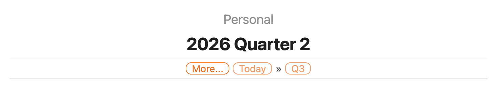

### Quarter section in the More popover

On a yearly note, the More popover gains a *Quarter* section listing `Q1`–`Q4` alongside the *Month* list. Each quarter follows the same exists/missing/today/past-faded rules as everything else, and clicking a past+missing quarter prompts before creating the note.

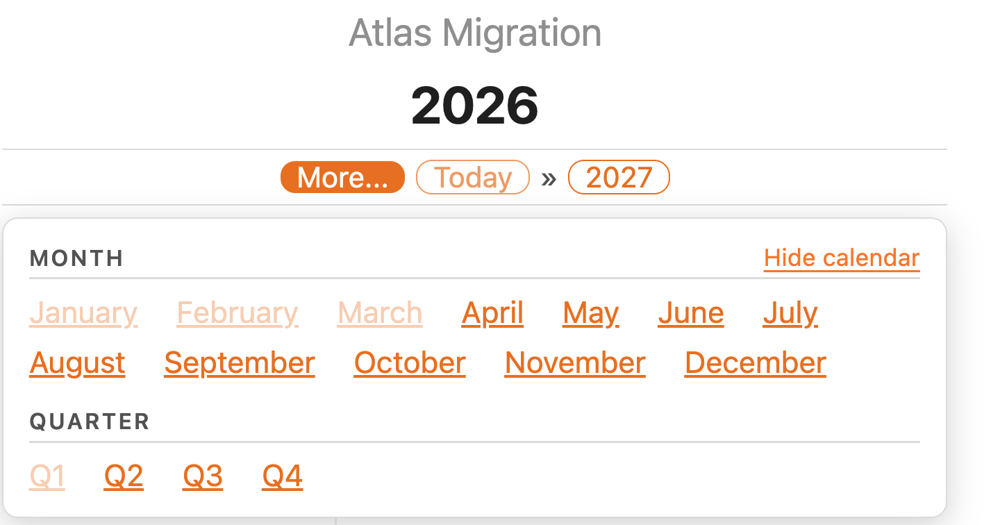

The higher-order chain on daily/weekly/monthly notes also gains the containing quarter — a daily note in May 2026 shows year (`2026`), quarter (`Q2`), month (`May`), week (`W19`) in its *Jump to* row. A quarterly note's primary lower-order list is the three months it contains.

### Calendar month-title annotations

Each month title in the calendar gets a `(Q1)`–`(Q4)` suffix so you can see at a glance which quarter you're in.

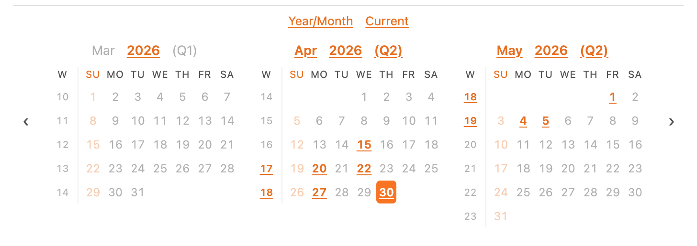

### Quarterly title patterns

Each tier has its own H1 / chip / cross-year link patterns, exactly like the other tiers. These are only consulted while `quarters-enabled` is on.

| Setting | What it does |
| --- | --- |
| `quarterly-note-title-pattern`        | H1 title pattern for quarterly notes. Don't include sub-quarter units. |
| `quarterly-note-short-title-pattern`  | Chip/link pattern for quarterly notes. Keep it short — multiple chips render side by side. |
| `quarterly-note-medium-title-pattern` | Pattern for quarterly-note links whose target is in a different year than the source — typically the short pattern plus the year, so the year change is explicit. |

The defaults are `YYYY [Quarter] Q` (e.g. `2026 Quarter 2`) for the H1, `[Q]Q` for chips, and `[Q]Q YY` for cross-year links.

---

## Tips

- **Templater** with the *Folder Templates* feature is the cleanest way to ensure every new note in a journal folder starts with the `journal-header` code block. The core *Templates* plugin works too.
- **Filename format is fixed.** If you have an existing journal in a different format, rename the files to one of the four supported patterns. The display patterns are entirely up to you; only the filename is rigid.

## License

GPL-3.0 — see `LICENSE.md`.
