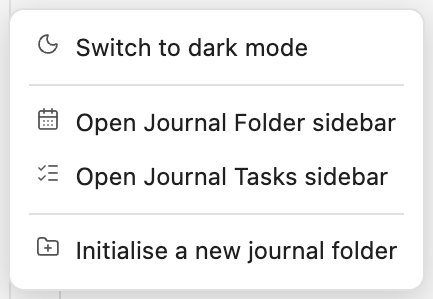
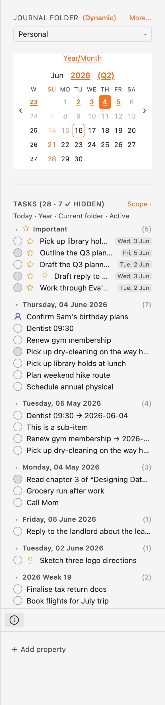
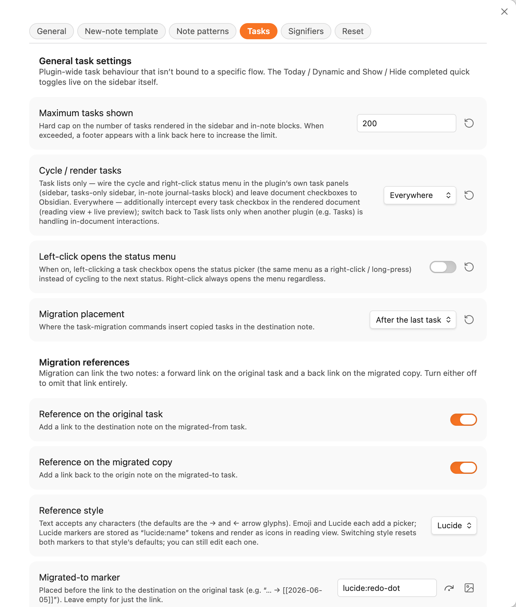
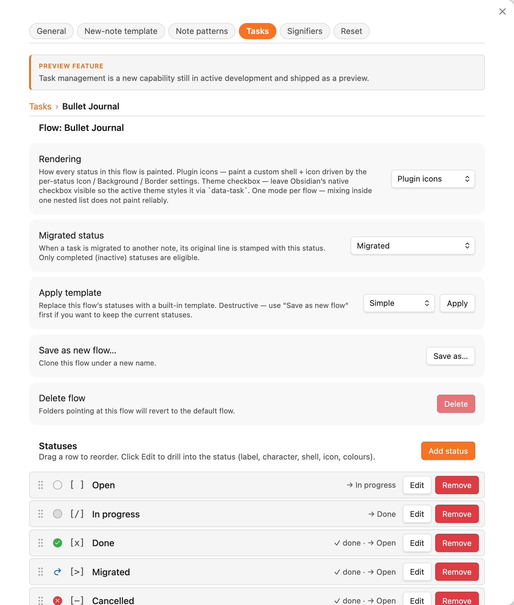
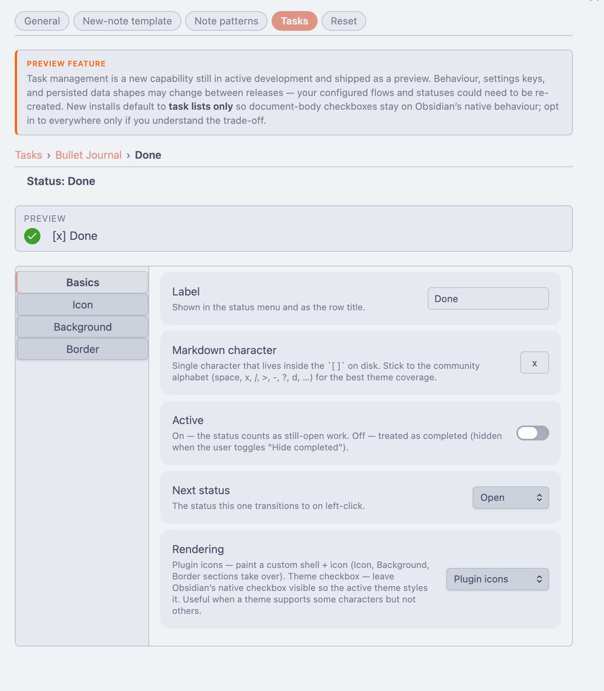
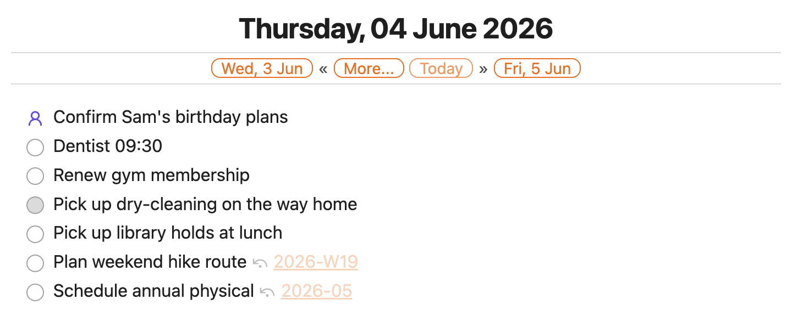
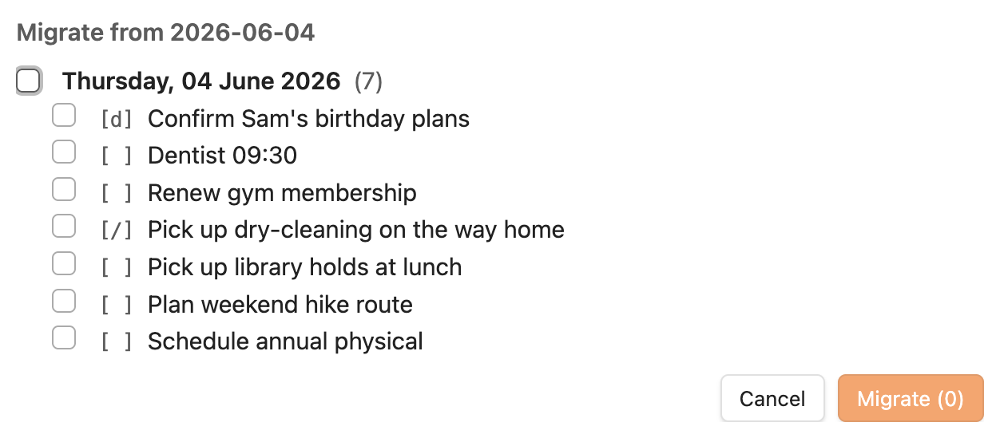
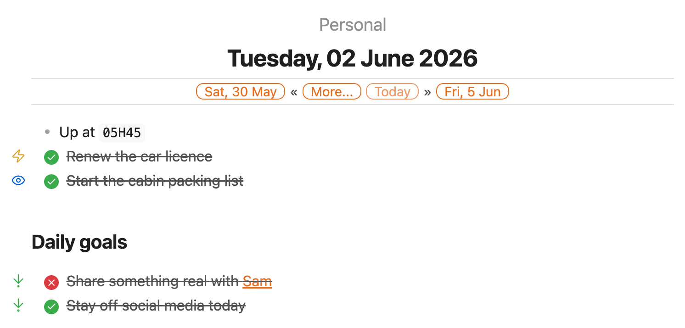
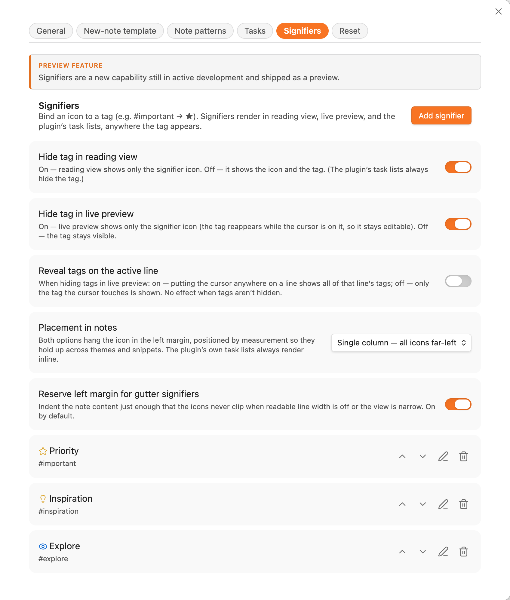

# Journal Folder

An Obsidian community plugin that turns *any* folder in your vault into a journal. Drop a note named `2026-05-04.md` (or `2026-W19.md`, `2026-05.md`, `2026.md`) into a folder, add a one-line code block at the top, and the plugin renders a navigable header, an inline calendar picker, and a sidebar with everything in reach.

You can run as many independent journals as you like in the same vault. A folder per project, a folder for personal notes, a folder per client — each gets its own settings, its own sequence of notes, and its own header.


## What you get

- **A navigable header** in every journal note — backward / forward chips, a *Today* link, a *More…* popover for higher-order period jumps, and an optional inline calendar. [Read more →](#the-journal-header)
- **A calendar picker** that mirrors your whole journal — existing / missing / today / current-note states, fold-out month grid, configurable defaults per platform. [Read more →](#the-calendar-picker)
- **A plugin menu** — one ribbon icon (and the *Open Journal Folder menu* command) opens a quick-action menu: open either sidebar, switch between light and dark mode, or initialise a new journal folder. [Read more →](#the-plugin-menu)
- **A sidebar tab** with folder picker, calendar, and one-click access to every journal-folder action — *Switch to default*, *Set as default*, *Edit folder configuration*, *Initialise a new journal folder*. [Read more →](#sidebar-tab)
- **Auto-fill new journal notes** with a per-folder or per-tier template, so you don't need Templater just to inject the `journal-header` block. [Read more →](#auto-fill-new-journal-notes)
- **Quarterly notes** as an opt-in fifth tier between yearly and monthly. [Read more →](#quarterly-notes-opt-in)
- **Tasks** — surface Markdown tasks from journal notes in the sidebar panel or in any note via a `journal-tasks` code block, with user-defined task flows, a scope picker (anchor × range + folder) for choosing exactly which tasks appear, and bullet-journal **task migration** that rolls unfinished tasks between notes with a reference trail. [Read more →](#tasks)
- **Signifiers** — bind an icon to a tag (BUJO-style) and it appears in the left margin wherever the tag does, so you can scan a note at a glance. [Read more →](#signifiers)

## Why folder-based?

Most journaling plugins assume one global daily-notes folder. *Journal Folder* assumes nothing about *where* journals live or *how many* you keep. Conventions that hold:

- A note's basename is its date. Filename formats are fixed; everything else (title, link labels, calendar visibility, folder title) is configurable.
- Settings cascade from global → folder → embedded. Per-folder overrides live in `journal-folder.md`; per-header overrides live inside the code block.
- The plugin only acts on files matching the date conventions, so the rest of the folder's contents are ignored.

The vault root is **not** supported as a journal folder — Obsidian's link resolution behaves differently there.

## Recognised file names

| Note type | Filename format | Example |
| --- | --- | --- |
| Daily     | `YYYY-MM-DD` | `2026-05-04.md` |
| Weekly    | `gggg-[W]ww` | `2026-W19.md`   |
| Monthly   | `YYYY-MM`    | `2026-05.md`    |
| Yearly    | `YYYY`       | `2026.md`       |

The weekly format uses ISO week-year (`gggg`/`gg`). If you customise weekly title patterns, use `gg`/`gggg` for the year — `YYYY` or `GGGG` will desync the displayed year from the filename around year boundaries.

A fifth tier — quarterly notes (`YYYY-Q[1-4]`) — is available as an opt-in. See [Quarterly notes](#quarterly-notes-opt-in).

## Install

The plugin is published to the Obsidian community plugin directory under the name **Journal Folder**. Open *Settings → Community plugins → Browse*, search for it, install, and enable.

To run from source, clone this repo and:

```bash
npm install
npm run build      # tsc --noEmit + production esbuild → main.js
```

Copy `main.js`, `manifest.json`, and `styles.css` into `<vault>/.obsidian/plugins/journal-folder/`.

## Getting started

1. Pick a folder in your vault for your journal (e.g. `Personal`, `Project — Atlas`, …). The vault root isn't supported — make it a real folder.
2. Click the **Journal Folder** ribbon icon (left edge of the workspace) and choose **Initialise a new journal folder** from the menu. Pick your folder.
3. The plugin creates a `journal-folder.md` in that folder. Click any cell on the calendar to create your first daily/weekly/monthly note — it gets the `journal-header` block automatically if you've turned on *Auto-fill new journal notes*.
4. Open the new note. You should see the rendered header at the top.

Once you have one journal folder, repeat the *Initialise* step for any other folder you want as a journal — each can have its own settings.

## Working with other plugins and themes

- **Themes that style task checkboxes** (Minimal, Things, AnuPpuccin, Border, …) coexist via per-status *theme* rendering. [Read more →](#using-with-a-theme-that-styles-tasks)
- **The Obsidian Tasks plugin** shares the same checkbox alphabet; keep `task-interaction-scope` on `lists` so both plugins stay out of each other's way. [Read more →](#using-with-the-obsidian-tasks-plugin)
- **Templater** with *Folder Templates* is the cleanest way to inject the `journal-header` block automatically if you'd rather not use the plugin's built-in auto-template.

## Configuration

Almost every setting can be edited from one of two UIs:

- **Global defaults** — *Settings → Community plugins → Journal Folder*.
- **Per-folder overrides** — sidebar tab → **More… → Edit folder configuration**.

The same form drives both, with global-only sections hidden in folder mode. Edits are stored sparsely in per-folder front matter, so fields that match the global default fall through automatically when you change the global default later.

For the underlying data structures, manual front-matter / `data.json` editing, and embedded-block syntax, see [Advanced configuration](#advanced-configuration). That section is the right reference if you're scripting setup across multiple vaults, storing config in source control, or overriding a single header from inside the note itself — but for day-to-day use, the settings UIs are the recommended path.

## Table of contents

User guide (everything below is in this page):

- [The journal header](#the-journal-header)
- [The calendar picker](#the-calendar-picker)
- [The plugin menu](#the-plugin-menu)
- [Sidebar tab](#sidebar-tab)
- [Auto-fill new journal notes](#auto-fill-new-journal-notes)
- [Quarterly notes (opt-in)](#quarterly-notes-opt-in)
- [Tasks](#tasks)
- [Signifiers](#signifiers)
- [Using with a theme that styles tasks](#using-with-a-theme-that-styles-tasks)
- [Using with the Obsidian Tasks plugin](#using-with-the-obsidian-tasks-plugin)
- [Advanced configuration](#advanced-configuration)

[Developer & contributor docs](#developer--contributor-docs) are separate files in the repo.

---

## The journal header

Every journal note gets a header by including a `journal-header` code block at the top:

````markdown
%% EDITING %%
```journal-header
```
````

That's it. The plugin replaces the code block with a rendered header keyed off the note's filename. The leading `%% EDITING %%` comment is optional but recommended — without it, opening a note in edit mode lands the cursor on the code block, which causes the rendered header to flicker into source until you click away. With the comment, the cursor lands on the comment line first; reading view drops the comment entirely and renders the header at the very top.

> [!TIP]
> Turn on the plugin's own [*Auto-fill new journal notes*](#auto-fill-new-journal-notes) feature to inject this block automatically into new notes — no extra plugins, and it's journal-aware (per-folder and per-tier templates). If you'd rather drive templating from elsewhere, the [Templater](https://silentvoid13.github.io/Templater/) plugin or the core *Templates* plugin can do the same job.

### What the header shows

#### Daily note


The primary row shows: backward chip, **More…** button, *Today* (only if the note isn't today), forward chip. The folder title at the top is optional (see *Folder title* below).

- **Backward link** — closest existing earlier daily note, or the note for the previous day if it doesn't exist yet but the date is today/future. Otherwise omitted.
- **Forward link** — symmetric: closest existing later daily note, or the next day if today/future.
- **Today** — links to today's daily note; only shown when the current note isn't today.
- **More…** — opens the popover (next section).

#### Weekly note


Backward/forward chips become weeks; *Today* always renders.

#### Monthly note


Backward/forward chips become months; *Today* always renders.

#### Yearly note


Backward/forward chips become years; *Today* always renders.

#### Without a folder title

If no folder title is configured, the row above the H1 is simply omitted:


### The More popover

The chips on the primary row are deliberately minimal. Higher-order period jumps and lower-order period lists live in the *More…* popover so the bar stays uncluttered.

#### From a daily note


The **Jump to** section lists higher-order periods that contain the current note: year (`2026`), month (`May`), week (`W19`) — plus the containing quarter (`2026 Quarter 2`) when [quarterly notes](#quarterly-notes-opt-in) are enabled, as in the screenshot above. For unspanning periods each link is shown only if a note exists for that period or if the period is current/future; when the current note straddles a tier boundary (e.g. a week that crosses March/April) all overlapping periods are listed, with past+missing entries rendered inactive. The **Show calendar** / **Hide calendar** toggle on the right opens or closes the inline calendar picker (see [The calendar picker](#the-calendar-picker)).

#### From a weekly note


A weekly note also exposes a **Day** section listing each day in the week, with the same exists/present/future filter applied to each link.

#### From a monthly note


A monthly note's lower-order section is **Week**; a yearly note's is **Month**. On yearly notes the *Jump to* section is empty (no higher-order periods exist), so the calendar toggle moves to the *Month* header on the right. The toggle reads *Hide calendar* here because the calendar is currently visible.

### Folder title resolution

The header's folder-title row is resolved as:

1. If `journal-folder-title` is configured (folder or embedded), use it.
2. Else if `use-folder-name-as-default-title` is true, use the folder's actual name.
3. Else omit the row entirely.

---

## The calendar picker

Toggle the calendar from the More popover on any journal note and the inline picker appears below the header. It reflects the same exists/missing/today/current state the rest of the plugin uses, so you can see your whole journal at a glance:


### Cell rules

Apply uniformly across day, week, month, quarter, and year cells:

- **Missing** — theme's normal text colour, faded at the theme's unresolved-link opacity. Past missing cells are faded an additional 50% so they read as more demoted than future missing cells. Clicking a past missing cell opens a confirmation modal before creating the note (so you don't accidentally create back-dated entries).
- **Existing** — accent colour, bold, underlined.
- **Sundays** — accent colour across every state (existing, future-missing, past-missing) and on the weekday header, so the start of the week is always easy to pick out.
- **Today** — accent ring around the cell.
- **Current note** — filled accent background. Travels with the note's time unit, so opening a monthly note paints the *month* cell, not the day:


Clicking a date that doesn't yet have a note creates it (with a confirm prompt for past dates). Arrows on the sides slide the visible month window by one month at a time.

### Quick-nav strip

The strip above the months grid carries up to three quick-nav controls:

- **Year/Month** — always shown. Opens a date-picker popover with year chevrons (`‹` and `›` shift by ±12 months) and a 4×3 grid of month names; clicking a month jumps the window straight to it.
- **Current** — appears only when the visible window has scrolled away from today's month. Clicking it snaps back.
- **Note month** — appears only when the visible window has scrolled away from the host note's own month, and only differs from *Current* once you start a session on a non-today note.

Both *Current* and *Note month* hide themselves when they'd be redundant, so the chrome quietly disappears as you navigate back into range.

### Responsive layout

The number of visible months is chosen automatically based on the available width, capped at 5. As the pane narrows the picker drops to a single month; on mobile the cells additionally enlarge for easier tapping:


### Default visibility

You can have the calendar open by default for new sessions — see `default-calendar-visible-desktop` and `default-calendar-visible-mobile` in the [settings reference](#settings-reference). The two platforms have independent defaults (calendar on for desktop, off for mobile) because the multi-month layout isn't useful at phone widths. A manual toggle from the More popover wins over any default for the rest of the running Obsidian session, so navigating between folders with different defaults won't override an explicit choice.

---

## The plugin menu

Everything the plugin does from outside a note hangs off a single **ribbon icon** on the left edge of the workspace (the notebook glyph, labelled *Journal Folder menu*). Clicking it opens a small action menu:



- **Switch to light / dark mode** — flips Obsidian's own *Base color scheme* (the same setting as *Settings → Appearance*). The label and icon track the current mode, so the row always offers the opposite. A vault set to *Adapt to system* is switched to an explicit light or dark scheme and left there.
- **Open Journal Folder sidebar** — reveals the [sidebar tab](#sidebar-tab) (folder picker, calendar, task panel).
- **Open Journal Tasks sidebar** — reveals the slim [tasks-only sidebar](#sidebar-task-panel).
- **Initialise a new journal folder** — the same fuzzy folder picker described under [More… menu](#more-menu); it creates the `journal-folder.md` and switches the sidebar to the new folder.

**On mobile**, Obsidian doesn't show the desktop ribbon, so the menu is also registered as the **Open Journal Folder menu** command — run it from the command palette, or pin it to the mobile toolbar (*Settings → Toolbar*). On a phone the menu opens as a centred sheet with roomier rows.

## Sidebar tab

A dedicated sidebar view collects journal-folder actions in one place. Open it from the [plugin menu](#the-plugin-menu) (**Open Journal Folder sidebar**) — the view docks in the right sidebar by default.


The header reads **JOURNAL FOLDER (Dynamic)** or **JOURNAL FOLDER (Static)** — the parenthesised tag tracks the current mode at a glance. A single **More...** link to the right of that label opens every secondary action; the folder picker beneath it switches between known journal folders.

### Folder picker

Every folder that contains a `journal-folder.md` shows up in the picker. Click the dropdown trigger and a panel lists them all:


In **dynamic** mode (the default), opening a journal note in a different folder switches the picker automatically — the calendar scrolls to that note's period and highlights its cell. In **static** mode the picker holds whichever folder you chose regardless of which note is open. Persists as the global `sidebar-mode` setting.

### Calendar

The calendar is the same single-month grid logic the in-note calendar uses, scoped to the selected folder. Clicking a day, week, month, quarter, or year cell opens (or creates) the corresponding journal note; past-dated cells with no existing note route through the same *Create missing note?* confirmation prompt the in-note calendar uses. The controls strip carries the same **Year/Month**, **Current**, and **Note month** quick-nav links as the in-note calendar, plus `‹` / `›` arrows for month-by-month navigation. In dynamic mode the calendar scrolls to follow the active note's period without clearing your manual `‹` / `›` history.

### Task panel

When the tasks feature is enabled (see [Tasks](#tasks)), the sidebar gains a panel below the calendar listing tasks in the current scope. The panel header carries a **Scope ▾** link that opens a small panel for choosing the *anchor* (Today / Current note), *range* (Day / Week / Month / Quarter / Year / All), folder scope, and the completed-tasks filter; a read-only summary line under the header shows the current selection at a glance. See [Sidebar task panel](#sidebar-task-panel) for the details.



### More... menu

A single text link to the right of the section header opens a panel with every secondary action. It's built from the current sidebar state, so options that don't apply right now are simply omitted (e.g. *Switch to default folder* is hidden when you're already on the default; *Edit folder configuration* is hidden when no journal folder is selected).


Items:

- **Switch to dynamic / Switch to static** — flips the mode (also reflected in the section-header tag). Persists as the global `sidebar-mode` setting.
- **Switch to default folder** — resets the picker to the configured `default-journal-folder`. Shown only when you're on a non-default folder *and* the configured default still exists in the known list.
- **Set as default folder** — promotes the currently selected folder to the new global default. Shown only when the picker is on a non-default journal folder. The default folder itself has no global-settings-tab UI — set it from here.
- **Edit folder configuration** — opens a modal containing the same form rows as the plugin settings tab, but writing to the selected folder's `journal-folder.md` front matter instead of the plugin's `data.json`. Global-only fields (`start-of-week`, `hide-journal-folder-notes`, the *Sidebar* section, the destructive *Reset all* button) are hidden. Per-folder fields show their **effective** value (global merged with the folder's existing front matter), and edits are stored sparsely — fields that match the global config are *removed* from the front matter so subsequent global edits keep flowing through, while diverging fields are written as kebab-cased keys.
- **Initialise a new journal folder** — opens a fuzzy folder picker showing every folder that *isn't* already a journal folder (the vault root is excluded — it's not a supported journal folder elsewhere in the plugin). Picking a folder creates a `journal-folder.md` in it seeded with `journal-folder-title: <folder name>`, then switches the sidebar's selected folder to the new one.

### Hiding the config notes

`journal-folder.md` files are hidden from Obsidian's file tree by default — the **Hide `journal-folder.md` in file explorer** toggle in the plugin settings tab. They remain on disk and remain reachable through search and the *Edit folder configuration* action above; the *Edit folder configuration* form is the preferred way to change per-folder settings, so most users never need to see the raw config note. Turn the toggle off if you'd rather hand-edit the front matter directly in the file tree.

---

## Auto-fill new journal notes

The plugin can seed new journal notes with a template body, so you don't need Templater (or another helper plugin) just to drop a `journal-header` code block at the top of every new note.

### Enabling

Off by default. Turn it on at any of two layers:

- **Globally** in *Settings → Community plugins → Journal Folder → Auto-fill new journal notes*.
- **Per folder** by adding `auto-template-enabled: true` (or `false` to disable) to that folder's `journal-folder.md` front matter. The easiest way is through the sidebar's **More... → Edit folder configuration** action.

When enabled, a new note is auto-filled only when **all** of these are true:

1. The note's basename matches a journal file pattern (`YYYY-MM-DD`, `gggg-[W]ww`, `YYYY-MM`, `YYYY-Q[1-4]` when quarters are enabled, or `YYYY`).
2. The folder containing the note has a `journal-folder.md` config file.
3. The note is empty at creation (existing content is never overwritten).

### One template, or one per note type?

A toggle in the plugin settings — *Use a different template per note type* — selects between the two modes. They are **mutually exclusive**: only one is in effect at a time.

- **Off** (default) — every new journal note (daily, weekly, monthly, quarterly, yearly) is seeded with the same *Default template*. The per-tier fields are hidden and ignored.
- **On** — pick a separate template for each note type via the *Daily / Weekly / Monthly / Quarterly / Yearly note template* fields. The generic *Default template* is hidden and ignored. A blank tier-specific field falls through to the built-in default rather than to the generic template.

The toggle is persisted as `auto-template-per-tier` and can be overridden per-folder in `journal-folder.md`.

### Template precedence

The template body is resolved in three layers, **first non-empty wins**:

1. **Per-folder body** — the markdown body of `journal-folder.md` (everything below its front matter). Use this when one folder needs a different template than the rest of the vault. Applies to every tier in that folder regardless of the toggle.
2. **Global setting** — depends on the toggle:
   - Toggle off: *Default template* (`auto-template-content`).
   - Toggle on: the matching *…note template* field for the new note's tier (`{daily,weekly,monthly,quarterly,yearly}-note-auto-template-content`).
3. **Built-in default** — `%% JOURNAL NOTE %%` followed immediately by an empty `journal-header` code block (no blank line between them, so the comment sits flush with the fence).

The `%% … %%` line is an Obsidian hidden comment — it doesn't render in reading mode and parks the cursor above the code block when toggling into edit mode. Without it, the cursor lands inside the fence and the block stops rendering until you click out.

### Different templates for different note types

Flip the *Use a different template per note type* toggle on (or set `auto-template-per-tier: true` per-folder) and the per-tier fields apply. For example, to give a folder a checklist for daily notes and a review prompt for weekly notes — while leaving monthly and yearly notes on the built-in default:

````markdown
---
auto-template-enabled: true
auto-template-per-tier: true
daily-note-auto-template-content: |
  %% JOURNAL NOTE %%
  ```journal-header
  ```

  ## Today's three priorities
  -
  -
  -

  ## Mood
weekly-note-auto-template-content: |
  %% JOURNAL NOTE %%
  ```journal-header
  ```

  ## Wins this week

  ## What to carry forward

  ## What to drop
---
````

When a tier-specific field is blank in this mode, the resolver falls through to the built-in default (the generic *Default template* is ignored while per-tier mode is on). The folder body (markdown below the front matter) still wins over every tier-specific field — leave it empty if you want the per-tier templates to be used.

### Per-folder template example

````markdown
---
journal-folder-title: Atlas Migration
auto-template-enabled: true
---

%% JOURNAL NOTE %%
```journal-header
```

## Highlights

## Notes
````

> [!TIP]
> If your template needs to contain a fenced code block (like the `journal-header` block above) and you want to wrap the *whole* template in another code block for clarity in `journal-folder.md`, use a tilde fence (`~~~`) for the outer wrapper or a longer run of backticks (4+) — anything longer than the inner fences. The plugin treats the entire body of `journal-folder.md` as the template, so wrapping isn't required; this only matters if you're showing the template to humans elsewhere.

### What the `journal-header` code block does in non-journal notes

The `journal-header` block is a no-op when placed in a note whose basename isn't a journal pattern. That means a template body containing the block stays harmless if it's pasted into `journal-folder.md` itself or any other regular note — it just renders nothing. Errors only show up if the block content is malformed config, not if the surrounding filename doesn't fit a journal pattern.

---

## Quarterly notes (opt-in)

Quarters are off by default. Turn them on and the plugin grows a fifth tier — quarterly notes — that slots between yearly and monthly. Everything else (the daily/weekly/monthly/yearly walkthrough in [The journal header](#the-journal-header)) keeps working unchanged; the quarter tier is purely additive.

### Enabling

Set `quarters-enabled: true` at any of the three layers:

- **Globally** in *Settings → Community plugins → Journal Folder* (a checkbox).
- **Per folder** in `journal-folder.md`'s front matter (or via the sidebar's *Edit folder configuration* action):

  ```markdown
  ---
  quarters-enabled: true
  ---
  ```

- **Per header** inside a single `journal-header` block:

  ````markdown
  ```journal-header
  quarters-enabled: true
  ```
  ````

Once on, files named `YYYY-Q[1-4]` (e.g. `2026-Q2.md`) are recognised as quarterly journal notes. With it off, those filenames stay inert — they're just regular notes with no header rendering.

### Quarterly note headers

A quarterly note gets the same header treatment as the other tiers. Backward/forward chips become quarters; *Today* always renders.


### Quarter section in the More popover

On a yearly note, the More popover gains a *Quarter* section listing `Q1`–`Q4` alongside the *Month* list. Each quarter follows the same exists/missing/today/past-faded rules as everything else, and clicking a past+missing quarter prompts before creating the note.


The higher-order chain on daily/weekly/monthly notes also gains the containing quarter — a daily note in May 2026 shows year (`2026`), quarter (`Q2`), month (`May`), week (`W19`) in its *Jump to* row. A quarterly note's primary lower-order list is the three months it contains.

### Calendar month-title annotations

Each month title in the calendar gets a `(Q1)`–`(Q4)` suffix so you can see at a glance which quarter you're in.


### Quarterly title patterns

Each tier has its own H1 / chip / cross-year link patterns, exactly like the other tiers. These are only consulted while `quarters-enabled` is on.

| Setting | What it does |
| --- | --- |
| `quarterly-note-title-pattern`        | H1 title pattern for quarterly notes. Don't include sub-quarter units. |
| `quarterly-note-short-title-pattern`  | Chip/link pattern for quarterly notes. Keep it short — multiple chips render side by side. |
| `quarterly-note-medium-title-pattern` | Pattern for quarterly-note links whose target is in a different year than the source — typically the short pattern plus the year, so the year change is explicit. |

The defaults are `YYYY [Quarter] Q` (e.g. `2026 Quarter 2`) for the H1, `[Q]Q` for chips, and `[Q]Q YY` for cross-year links.

---

## Tasks

> [!NOTE]
> Fresh installs default to interacting only with the plugin's own task lists ([see *Scope of task interactions*](#scope-of-task-interactions)) so existing vaults aren't silently changed.

The tasks feature surfaces Markdown tasks (`- [ ] …` / `- [x] …` and friends) from your journal notes in three places:

1. A panel below the calendar in the **sidebar tab**.
2. A slim **Tasks-only sidebar** (its own view, opened from the [plugin menu](#the-plugin-menu) → **Open Journal Tasks sidebar**).
3. An in-note **`journal-tasks` code block**, analogous to `journal-header`.

A task shows up wherever its source note's date range intersects the **reference window** you're viewing. In the sidebar you choose that window with two controls — an *anchor* (today, or the note you're currently in) and a *range* (day / week / month / quarter / year, or *All* for no date filter); see [Sidebar task panel](#sidebar-task-panel). There's no completion-date stamping — a task's position comes purely from the note it lives in.

### Task flows

A **task flow** is a named ordered set of statuses. Each status has:

- A **label** (e.g. *Open*, *In progress*, *Done*).
- A **character** used inside `[ ]` on disk (e.g. ` `, `/`, `x`).
- A **next** target — what the left-click cycle moves to.
- A **rendering** choice — either let the active Obsidian theme draw the checkbox, or have the plugin paint a custom shell + icon + colour.
- An `isDone` flag that drives the *Hide completed* filter.

Four **built-in templates** ship as read-only starting points — apply one to seed or reset a flow:

| Template | Statuses |
| --- | --- |
| **Simple** | `[ ]` `[x]` |
| **Kanban** | `[ ]` `[/]` `[x]` |
| **Bullet Journal** | `[ ]` `[/]` `[x]` `[>]` `[-]` `[d]` |
| **GTD** | `[ ]` `[/]` `[?]` `[x]` |

Flows live globally on the plugin settings — they're defined in *Settings → Community plugins → Journal Folder → Tasks*. Each folder picks **which** flow it uses (via the per-folder *Tasks* tab in the *Edit folder configuration* modal); edits to a flow's statuses propagate to every folder pointing at the same flow.



Drilling into a flow opens an editor with apply-template / save-as / delete actions and the status list. Each status can be drilled into further for per-status appearance.





### Sidebar task panel

When *Show task panel in sidebar* is on, the sidebar tab grows a tasks section below the calendar:


The panel header shows the task count on the left and a **Scope ▾** link on the right. Below it a read-only summary line shows the current selection at a glance — `Anchor · Range · Folders · Filter`, e.g. `Today · Week · All folders · Active`. Click **Scope ▾** to open the scope panel, which has four sections:

- **Anchor** — *Today* (measure from the current date) or *Current note* (measure from the journal note you're reading; falls back to today on a non-journal leaf).
- **Range** — *Day / Week / Month / Quarter / Year* lists tasks whose notes fall in the calendar period of that size around the anchor; *All* drops date filtering entirely (every task in the chosen folders). *Quarter* appears only when quarterly notes are enabled.
- **In folders** — *Current note's folder*, *All journal folders*, or a single specific folder. This is independent of the anchor, so you can, say, show *this week* across *all folders*, or *all* tasks in *just the current note's folder*.
- **Filter** — *Show completed tasks* toggles whether statuses whose `isDone` is true appear; the header surfaces the hidden count when they're hidden.

Changes apply immediately and the panel stays open so you can adjust several at once. The **Tasks-only sidebar** has the same panel with its own independent selection.

Each row shows the status icon (clickable to cycle, right-click for a full status menu), the task text with internal links live, and a muted chip linking back to the source note (`daily · 2026-06-03`, `weekly · W23`, …). Rows are single-line with full text in the `title` attribute. The list is sorted with daily tasks first, then weekly, monthly, quarterly, yearly — and capped by `tasksMaxItems` (default 200) with a *Showing 200 of 247 — increase limit in settings* footer when truncated.

### In-note `journal-tasks` block

Drop a `journal-tasks` code block into any note and the plugin replaces it with the same task-list component the sidebar uses:

````markdown
```journal-tasks
units: weekly, monthly, quarterly, yearly
```
````

Optional keys (case-insensitive, separators tolerant):

| Key | Default | Notes |
| --- | --- | --- |
| `folders` | host note's folder | Required when the host note isn't itself a journal note. Comma-separated paths. |
| `units` | all tiers (gated by `quartersEnabled`) | Restrict which note tiers are scanned: `daily`, `weekly`, `monthly`, `quarterly`, `yearly`. |
| `show-completed` | `false` | Seeds the view-local *Show completed* toggle. Toggling in the rendered list does **not** persist back to the markdown. |
| `max-items` | global `tasksMaxItems` | Truncation cap for this block. |

Inside a journal note, the **reference range** is the host's range — so a `journal-tasks` block in a weekly note lists tasks from that week's daily notes (plus the weekly itself). Inside a non-journal note, the reference range falls back to today.

### Migrating tasks between notes

Bullet-journal style, *migration* moves an unfinished task from one note to
another **within the same folder** — say, rolling today's leftovers onto
tomorrow, or a week's open items up into the next week. It doesn't just move
text; it leaves a trail in both directions.

When you migrate one or more tasks:

1. The **origin** line is stamped with the flow's *migrated* status (an inactive
   status such as `[>]`) so it reads as moved, not done, and drops out of active
   lists.
2. A **copy** is written into the destination note at the position you've
   configured (see below), as a fresh top-level task.
3. **Cross-references** are added so you can hop between the two: a *forward*
   reference on the origin pointing at the destination, and a *back* reference
   on the copy pointing at the origin.



In reading view each reference renders as a small marker plus a link, faded to
the background (full opacity on hover) so the note stays readable. The plugin's
own task lists strip the reference markers from the displayed text.

#### Triggering a migration

Three entry points, all scoped to a single folder:

- **Per-task** — right-click a task (editor menu) → *Migrate this task…*.
- **From this note / To this note** — the file menu (⋯) offers *Migrate
  tasks from this note…* and *…to this note*, which open a grouped multi-select
  picker. Nothing is selected by default — tick the tasks you want and confirm.



#### Settings

Migration is configured under *Settings → … → Journal Folder → Tasks* (and the
placement keys are also honoured per-folder, since they're a per-note layout
concern):

- **Migration placement / heading** — where copies land in the destination:
  *After the last task*, *Top of note*, *End of note*, or *Under a heading* (with
  the heading text you specify).
- **Reference on the original task** / **Reference on the migrated copy** —
  toggle either direction off if you only want one trail.
- **Reference style** — *text*, *emoji*, or *lucide* (the default; markers are
  stored as `lucide:<name>` tokens and rendered as icons in reading view). Each
  style has editable *to* / *from* markers (the defaults are redo/undo arrows).
- **Reference opacity** — how faded the references render (default 30%).

### Scope of task interactions

`task-interaction-scope` controls where the plugin's task-icon rendering and click handling apply:

- **`lists`** (default for new installs) — only inside the plugin's own task surfaces: the sidebar panel and `journal-tasks` blocks. Document-body checkboxes are left to Obsidian's native rendering and click behaviour, so existing vaults keep behaving as they always have.
- **`everywhere`** — the plugin also intercepts every task checkbox in the rendered document, both in reading view and live preview. Useful if you want the custom shell/icon and configured cycle to apply uniformly across the vault. Opt in only if you understand that other plugins (notably the Obsidian Tasks plugin) and themes may compete for the same DOM.

This is a **global-only** setting — interception happens at process-wide layers, so per-folder and embedded overrides are ignored.

### Tasks plugin and theme interop

The community-conventional checkbox alphabet (`[ ]` `[/]` `[x]` `[>]` `[-]` `[d]` `[?]`) is exactly what most theme/plugin ecosystems read, so notes stay portable. See:

- [Using with a theme that styles tasks](#using-with-a-theme-that-styles-tasks)
- [Using with the Obsidian Tasks plugin](#using-with-the-obsidian-tasks-plugin)

---

## Signifiers

In a paper bullet journal, *signifiers* are little marks in the margin — a star
for something important, an exclamation for an idea — that let you scan a page
and find what matters without reading every line. This plugin brings the same
idea to your notes: bind an **icon** to a **tag**, and wherever that tag
appears the icon shows up in the left margin.



Three signifiers ship by default:

| Signifier | Tag | Icon |
| --- | --- | --- |
| **Priority** | `#important` | ⭐ star |
| **Inspiration** | `#inspiration` | 💡 lightbulb |
| **Explore** | `#explore` | 👁 eye |

Signifiers apply to **any** rendered markdown — paragraphs, bullets, headings,
tasks — not just task lists. A line can carry several (just add several tags);
each gets its own icon, in the order you've configured them.

### Where the icon sits

The **Placement in notes** setting controls how the margin icons line up. Both
options hang the icon in the left margin (paper-journal style); they differ in
alignment:

- **Single column — all icons far-left** (the default) — every icon lines up in
  one column at the far left, no matter how deeply the line is nested. This is
  the classic left-rule look.
- **Per entry** — the icon hangs just left of each line, following its
  indentation, so nested items get nested markers.

The horizontal position is *measured* from your actual layout rather than
hard-coded, so the markers stay put across themes, CSS snippets, and
readable-line-width settings instead of colliding with restyled bullets or
checkboxes.

**Reserve left margin for gutter signifiers** (on by default) keeps a sliver of
space at the left edge so the icons never get clipped when readable line width
is off or the pane is narrow. Leave it on unless you have a specific reason not
to.

### Hiding the tag

By default the literal `#important` text is replaced by the icon so your notes
stay clean:

- **Hide tag in reading view** (on) — reading view shows only the icon.
- **Hide tag in live preview** (on) — the editor shows only the icon too, but
  the tag *reappears while your cursor is on it* so it stays editable.
- **Reveal tags on the active line** (off) — when on, putting the cursor
  anywhere on a line reveals all of that line's tags; when off, only the tag the
  cursor actually touches is revealed.

Turn the hide options off and the icon is shown *alongside* the tag instead of
replacing it.

In the plugin's own task lists (the sidebar panel and `journal-tasks` blocks)
the signifier icon always renders and the tag is always stripped from the
displayed text.

### Managing signifiers

Signifiers have their own tab: *Settings → Community plugins → Journal Folder →
Signifiers*. Add, reorder, and edit them there — each binds one or more tags to
an icon (any Lucide icon or an emoji) with an optional colour for Lucide icons.



Signifiers are **global** — there's one shared set for the whole vault, not a
per-folder list.

#### Tagging a line quickly

You don't have to type tags by hand. The command **"Modify signifiers on the
current line…"** (also on the editor right-click menu) opens a checklist of your
signifiers, pre-ticked with the ones already on the line. Tick or untick and
apply — the plugin adds or removes the matching tags for you and leaves the rest
of the line untouched.

In **editing view** the margin gutter is also clickable: click a line's
signifier icons to open that same checklist. On a line that doesn't have a
signifier yet, a faint **+** fades in the margin as you hover the line — click it
to add one. The cursor turns to a pointer over the gutter so you can tell it's
interactive.

---

## Using with a theme that styles tasks

Several popular Obsidian themes — **Minimal**, **Things**, **AnuPpuccin**, **Border**, and others — ship custom checkbox styling that recognises the community-conventional alphabet (`[ ]`, `[/]`, `[x]`, `[>]`, `[-]`, sometimes `[d]` / `[?]`). Journal Folder is designed to coexist with these themes; you can pick per-status which side draws the checkbox.

### The two rendering modes

Every status in a task flow has a **rendering** field:

- **`theme`** — the plugin emits Obsidian's native `<input type="checkbox" data-task="…">` element and lets the active theme's CSS do the styling. This is the right choice for any status whose character your theme already handles.
- **`plugin`** — the plugin paints a custom shell (shape, background, border, colour) and inner glyph (Lucide icon, emoji, image URL, or sanitised inline SVG). This is the right choice for statuses your theme doesn't know about, or when you want a specific look regardless of theme.

The choice is **per-status**, not per-flow — a single flow can mix theme-styled and plugin-painted rows. That's exactly what you want when a theme supports `[ ]` `[/]` `[x]` but not your custom `[d]` / `[?]`: leave the supported chars on `theme`, let the plugin paint the rest.

The rendering field lives in *Settings → Community plugins → Journal Folder → Tasks → \<flow\> → \<status\> → Basics*.

### Recommended starting point

1. Apply the built-in template that matches your workflow as a starting flow (Simple / Kanban / Bullet Journal / GTD).
2. Switch each status's *Rendering* to **theme** if your theme already styles its character.
3. Leave statuses your theme doesn't recognise on **plugin** rendering and pick a shell + icon that fits.

### Scope of interaction

If you only want the plugin's task surfaces (sidebar panel, `journal-tasks` blocks) to use your configured rendering — and want document-body checkboxes left entirely to Obsidian / your theme — leave **`task-interaction-scope`** on its default value of **`lists`**. This is the default for fresh installs and is the safest mode when you're relying on a theme to drive visuals.

If you'd rather have the plugin's rendering apply uniformly to every task checkbox in the vault (so the configured plugin-painted shells appear in regular notes too, not just journal surfaces), switch the scope to **`everywhere`**. Note that this competes with theme CSS — anywhere you've set a status to `plugin` rendering, the theme's checkbox styling for that character will be overridden by the plugin's shell.

### Caveats

- **Custom characters your theme doesn't know about** render as plain checkboxes in theme-styled documents. The plugin's own surfaces (sidebar, `journal-tasks` blocks) stay accurate either way.
- **Theme CSS targeting `input[type="checkbox"]`** only applies to statuses with `rendering: theme`. Plugin-painted rows are real DOM `<span>` shells and won't be touched by checkbox-selector CSS.
- **`is-checked` class.** Some themes change their styling based on Obsidian's `is-checked` class, which is only added to native checkboxes whose status is `[x]`. For other "done" characters (`[>]`, `[-]`), the plugin still treats them as done for filtering but the theme may not.

---

## Using with the Obsidian Tasks plugin

The community **[Tasks](https://publish.obsidian.md/tasks/)** plugin (`obsidian-tasks-plugin`) and Journal Folder coexist on the same checkbox alphabet. They were designed independently, so a few configuration choices keep them from stepping on each other.

> [!IMPORTANT]
> Journal Folder's task surfaces are **present-only** and date-driven by the source note's filename. The Tasks plugin's query language (due dates, scheduled dates, recurrence, priorities, tags, paths) is far richer. The two are complementary: use Journal Folder's sidebar panel and `journal-tasks` blocks to surface what's on the current day/week/month at a glance; use Tasks-plugin queries for due-date filtering, recurrence, and global rollups.

### Sharing the same checkbox alphabet

The Tasks plugin reads (and writes) the same characters Journal Folder's built-in templates do:

| Char | Meaning |
| --- | --- |
| `[ ]` | open / todo |
| `[/]` | in progress |
| `[x]` | done |
| `[>]` | forwarded / migrated |
| `[-]` | cancelled |

If you pick the **Bullet Journal** or **Kanban** template as the starting point for a flow (and leave the characters at their defaults), notes are interchangeable — the Tasks plugin can query them, and Journal Folder can render them in the sidebar.

### Recommended setting: leave `task-interaction-scope` on `lists`

When both plugins are installed, leave Journal Folder's **`task-interaction-scope`** on its default value of **`lists`**. This means:

- Journal Folder's icon rendering and click-cycle apply only inside the plugin's own surfaces (sidebar panel + `journal-tasks` blocks).
- Document-body checkboxes everywhere else are left to Obsidian and the Tasks plugin to render and handle.

That avoids two plugins both trying to intercept the same click on the same checkbox in the same document.

If you want Journal Folder's rendering to apply everywhere, set the scope to `everywhere` — but expect the Tasks plugin's hover preview, edit modal, and query rendering to behave differently on those rows. They aren't strictly incompatible; they just compete for the same DOM.

### Status state mapping

Journal Folder's `isDone` flag and the Tasks plugin's *Status Settings* control the "done" concept independently. If you want both plugins to treat `[>]` and `[-]` as done:

- **In Journal Folder:** make sure the status's `isDone` is `true` in the flow editor — the built-in templates already set this.
- **In Tasks plugin:** under *Status Settings*, set both characters' *Status Type* to `DONE` (or `CANCELLED`, which Tasks treats as terminal for query purposes).

### Cycle order

The Tasks plugin's own *Cycle through tasks* command cycles statuses in the order configured in *Status Settings*. Journal Folder's per-status **next** field is independent — it only drives the click cycle inside the plugin's own surfaces. Configure both if you want consistent behaviour from both keyboard (Tasks plugin command) and mouse-click (Journal Folder surfaces).

### Tasks-plugin metadata

The Tasks plugin appends emoji metadata (e.g. `📅 2026-06-15`, `⏫`, `🔁 every week`) to the task text on disk. Journal Folder keeps that text verbatim — it doesn't parse or hide the metadata, and clicking the status icon to cycle preserves it. Rows render with the metadata visible in the sidebar; if you want it hidden, your theme's CSS is the place to do it.

### Queries vs. `journal-tasks`

The two block types target different needs and can both live in the same note:

- **`tasks` block (Tasks plugin)** — query by metadata (`due before next week`, `priority is high`, `path includes Project`).
- **`journal-tasks` block (Journal Folder)** — surface tasks from journal notes whose date range intersects the host note's range.

A weekly review note can hold both: a `journal-tasks` block at the top to list everything written down during the week, and a Tasks-plugin block below it for `due before tomorrow` rollups.

---

## Advanced configuration

> [!IMPORTANT]
> **This is an advanced topic.** Every setting on this page can be edited from the provided UIs — the global *Settings → Community plugins → Journal Folder* tab for vault-wide defaults, and the sidebar's **More... → Edit folder configuration** modal for per-folder overrides. Reach for the file-level configuration covered here only when you need to script setup across multiple vaults, automate per-folder configuration, store config in source control, or override a single header from inside the note itself.
>
> Hand-editing the underlying data structures is fully supported, but the settings UIs are the recommended path because they validate as you go and keep the per-folder front matter sparse.

### The three resolution layers

Settings are resolved in three layers, **last wins**:

1. **Global** — set in *Settings → Community plugins → Journal Folder*. Persists in `.obsidian/plugins/journal-folder/data.json`.
2. **Folder** — front-matter of a file named `journal-folder.md` in the same folder as the journal note. Subfolders never inherit from a parent folder's `journal-folder.md` — each folder controls its own settings.
3. **Embedded** — body of the current `journal-header` (or `journal-tasks`) code block, parsed line-by-line as `key: value`. Applies only to that one block.

Setting names are case-insensitive and tolerant of separators. All of the following are equivalent:

```
journal-folder-title: Atlas Migration
journal_folder_title: Atlas Migration
JOURNAL_FOLDER_TITLE: Atlas Migration
Journal folder title: Atlas Migration
```

### Layer 1 — global data.json

The plugin persists its global settings under `.obsidian/plugins/journal-folder/data.json`. Field names there are `camelCase` (e.g. `dailyNoteTitlePattern`, `quartersEnabled`, `taskFlows`). The settings UI is the canonical writer — hand-edit only when you're scripting setup or syncing across vaults.

The full default shape lives in `src/data-access/journal-folder-settings.type.ts` under `DEFAULT_SETTINGS`. A representative shape:

```jsonc
{
  "dailyNoteTitlePattern": "dddd, DD MMMM YYYY",
  "dailyNoteShortTitlePattern": "ddd, D MMM",
  "weeklyNoteTitlePattern": "gggg [Week] w",
  "monthlyNoteTitlePattern": "MMMM YYYY",
  "yearlyNoteTitlePattern": "YYYY",

  "quartersEnabled": false,
  "autoTemplateEnabled": false,
  "autoTemplatePerTier": false,

  "startOfWeek": "locale-default",
  "defaultJournalFolder": "",
  "hideJournalFolderNotes": true,
  "sidebarMode": "dynamic",

  "tasksSidebarEnabled": false,
  "tasksSidebarReference": "dynamic",
  "tasksMaxItems": 200,
  "taskFlow": "",
  "defaultTaskFlow": "Default",
  "taskInteractionScope": "lists",
  "taskFlows": {
    "Default": [ /* TaskStatus[] — see Task-flow data shape below */ ]
  }
}
```

#### Global-only fields

A handful of fields are intentionally **not** honoured at the folder or embedded layers:

- `startOfWeek` — moment's locale is process-wide; per-folder weekday overrides would desync week numbering across the vault.
- `defaultJournalFolder` — UI preference, not a per-folder concept.
- `hideJournalFolderNotes` — affects every `journal-folder.md` row in the file explorer.
- `sidebarMode` — the sidebar is a singleton view.
- `tasksSidebarEnabled`, `tasksSidebarReference`, `tasksSidebarFolders`, `tasksShowCompleted`, `tasksMaxItems` — sidebar / process-wide task UI.
- `taskFlows`, `defaultTaskFlow` — flow definitions live globally; folders pick which flow they use, not what's in it.
- `taskInteractionScope` — interception runs at process-wide layers (markdown post-processor, editor extension).
- `signifiers`, `signifierPlacement`, `signifierHideTagInReadingView`, `signifierHideTagInLivePreview`, `signifierShowTagsOnActiveLine`, `signifierReserveGutter` — one signifier set per vault; see [Signifiers](#signifiers).
- `taskCategories`, `taskCategoryShowUnderNote` — category definitions are vault-wide.
- the migration *reference* fields (`taskMigrationAddToReference`, `taskMigrationAddFromReference`, `taskMigrationReferenceStyle`, `taskMigrationToMarker`, `taskMigrationFromMarker`, `taskMigrationReferenceOpacity`). The **exception** is `taskMigrationPlacement` / `taskMigrationHeading`, which *are* folder-honoured — they're a per-note layout concern, not a process-wide preference.

### Layer 2 — per-folder `journal-folder.md`

A file named `journal-folder.md` in any folder turns that folder into a journal folder. Per-folder overrides live in its YAML front matter as **kebab-cased keys**:

```markdown
---
journal-folder-title: Atlas Migration
default-calendar-visible-desktop: true
default-calendar-visible-mobile: false
daily-note-title-pattern: dddd, Do MMMM YYYY
quarters-enabled: true
task-flow: Bullet Journal
---
```

The **body** of `journal-folder.md` (everything below the closing `---`) is the per-folder auto-template content. See [auto-template precedence](#template-precedence).

`task-flow` is the only task-related field that a folder may override — flow contents (`taskFlows`) are still edited globally, and everything else in the *Tasks* section is global-only.

> [!TIP]
> The recommended way to edit per-folder settings is the **sidebar tab → More… → *Edit folder configuration*** action. It opens a form pre-populated with the effective values, validates as you go, and writes a sparse diff to `journal-folder.md` so the folder still inherits future global changes for any field you didn't deliberately diverge on.

> [!CAUTION]
> Anything set at folder level applies to every journal header in that folder, but does *not* affect the actual folder name on disk. `journal-folder-title` is a display label only.

### Layer 3 — embedded `key: value`

Inside the body of any `journal-header` or `journal-tasks` code block, lines of the form `key: value` override the same field for that single block:

````markdown
%% EDITING %%
```journal-header
default-calendar-visible-desktop: true
daily-note-title-pattern: dddd, Do MMMM YYYY
```
````

This is the right layer for one-off experiments, examples in documentation, or notes that need to override the folder default for a single rendering.

### Settings reference

All title patterns use [moment.js format syntax](https://momentjs.com/docs/#/displaying/format/). Front-matter keys shown here are the kebab-cased form used by per-folder and embedded layers; the `camelCase` data.json equivalents are derived by stripping the dashes and uppercasing the next letter.

| Setting | What it does |
| --- | --- |
| `daily-note-title-pattern`           | H1 title pattern for daily notes. Don't include sub-day units (hours, minutes). |
| `daily-note-short-title-pattern`     | Pattern used for chips/links pointing to daily notes. Keep it short — multiple chips render side by side. |
| `daily-note-medium-title-pattern`    | Pattern for daily-note links whose target is in a different year than the source — typically the short pattern plus the year, so the year change is explicit. |
| `weekly-note-title-pattern`          | H1 title pattern for weekly notes. **Use `gg`/`gggg` for the year**, not `YYYY`/`GGGG` — the filename uses ISO week-year and they desync at year boundaries. |
| `weekly-note-short-title-pattern`    | Chip/link pattern for weekly notes. Same `gg`/`gggg` caveat. |
| `weekly-note-medium-title-pattern`   | Cross-year weekly link pattern. Same caveat. |
| `monthly-note-title-pattern`         | H1 title pattern for monthly notes. Don't include sub-month units. |
| `monthly-note-short-title-pattern`   | Chip/link pattern for monthly notes. |
| `monthly-note-medium-title-pattern`  | Cross-year monthly link pattern. |
| `quarterly-note-title-pattern`       | H1 title pattern for quarterly notes (when `quarters-enabled` is on). |
| `quarterly-note-short-title-pattern` | Chip/link pattern for quarterly notes. |
| `quarterly-note-medium-title-pattern`| Cross-year quarterly link pattern. |
| `yearly-note-title-pattern`          | H1 title pattern for yearly notes. Don't include sub-year units. |
| `yearly-note-short-title-pattern`    | Chip/link pattern for yearly notes. |
| `yearly-note-medium-title-pattern`   | Cross-year yearly link pattern (rare; usually identical to short). |
| `journal-folder-title`               | Display title shown above the H1 in the header. Typically set per-folder, not globally. |
| `use-folder-name-as-default-title`   | If true and `journal-folder-title` isn't set, falls back to the folder name. |
| `default-calendar-visible-desktop`   | If true, the calendar picker is open by default on desktop when Obsidian starts. A manual toggle in the current session wins over this. |
| `default-calendar-visible-mobile`    | If true, the calendar picker is open by default on mobile when Obsidian starts. Defaults to false because the multi-month layout isn't useful at phone widths. |
| `quarters-enabled`                   | Enables quarterly notes (`YYYY-Q[1-4]`) as a fifth tier. See [Quarterly notes](#quarterly-notes-opt-in). |
| `start-of-week`                      | First day of the week used by the calendar grid and `gggg-[W]ww` weekly numbering. *Locale default* leaves moment's locale untouched; picking an explicit weekday (`sunday`–`saturday`) overrides it so week 1 still contains January 1. **Global only.** |
| `auto-template-enabled`              | If true, newly created notes whose basename matches a journal pattern and whose folder contains a `journal-folder.md` are seeded with a template body. See [Auto-fill new journal notes](#auto-fill-new-journal-notes). |
| `auto-template-per-tier`             | If false (default), every new journal note shares `auto-template-content`. If true, the per-tier fields below are used instead, one per note type. The two modes are mutually exclusive. |
| `auto-template-content`              | Single template body used when `auto-template-per-tier` is **off**. Leave blank for the built-in default. Per-folder overrides go in the body of `journal-folder.md`. |
| `daily-note-auto-template-content`   | Template body used for new daily notes when `auto-template-per-tier` is **on**. |
| `weekly-note-auto-template-content`  | Template body used for new weekly notes when `auto-template-per-tier` is **on**. |
| `monthly-note-auto-template-content` | Template body used for new monthly notes when `auto-template-per-tier` is **on**. |
| `quarterly-note-auto-template-content` | Template body used for new quarterly notes when `auto-template-per-tier` is **on**. |
| `yearly-note-auto-template-content`  | Template body used for new yearly notes when `auto-template-per-tier` is **on**. |
| `default-journal-folder`             | Folder path the sidebar tab opens on by default. **Global only.** |
| `hide-journal-folder-notes`          | If true (the default), every `journal-folder.md` is hidden from Obsidian's built-in file explorer. **Global only.** |
| `sidebar-mode`                       | `'dynamic'` (default) makes the sidebar follow the active note; `'static'` holds whichever folder you picked. **Global only.** |
| `tasks-sidebar-enabled`              | Whether the sidebar tab renders the tasks panel below the calendar. **Global only.** |
| `tasks-sidebar-reference`            | `'today'` or `'dynamic'`. Sidebar's reference range for the task panel. **Global only.** |
| `tasks-sidebar-folders`              | Comma-separated folder paths the sidebar's `Today` mode scans; empty = all known journal folders. **Global only.** |
| `tasks-show-completed`               | If true, completed (`isDone`) statuses appear in task lists. **Global only.** |
| `tasks-max-items`                    | Hard cap on rendered tasks per list (default 200). **Global only.** |
| `task-flow`                          | Per-folder override — name of the flow this folder uses. Empty falls back to `default-task-flow`. Per-folder. |
| `default-task-flow`                  | Name of the flow used by folders without an override. **Global only.** |
| `task-flows`                         | Dictionary of named flows. **Global only.** See *Task-flow data shape* below. |
| `task-interaction-scope`             | `'lists'` (default) — interactions only on the plugin's own task surfaces. `'everywhere'` — intercept every task checkbox in rendered documents. **Global only.** |
| `task-migration-placement`           | Where migrated task copies land in the destination note: `after-last-task` (default), `top`, `end`, or `heading`. Per-folder. See [Migrating tasks](#migrating-tasks-between-notes). |
| `task-migration-heading`             | Heading text used when `task-migration-placement` is `heading` (default `Tasks`). Per-folder. |
| `task-migration-add-to-reference`    | Whether the origin task gets a forward reference to the destination (default true). **Global only.** |
| `task-migration-add-from-reference`  | Whether the migrated copy gets a back reference to its origin (default true). **Global only.** |
| `task-migration-reference-style`     | `text` / `emoji` / `lucide` (default) — how reference markers render. **Global only.** |
| `task-migration-to-marker` / `task-migration-from-marker` | The forward / back marker for the active style (Lucide markers are `lucide:<name>` tokens). **Global only.** |
| `task-migration-reference-opacity`   | How faded references render, 0–100 (default 30). **Global only.** |
| `signifier-placement`                | `margin-column` (default, all icons far-left) or `margin` (per-entry). **Global only.** See [Signifiers](#signifiers). |
| `signifier-hide-tag-in-reading-view` / `signifier-hide-tag-in-live-preview` | Replace the matched tag with just the icon in reading view / live preview (both default true). **Global only.** |
| `signifier-show-tags-on-active-line` | When hiding tags in live preview, reveal *all* of the cursor line's tags (default false reveals only the touched tag). **Global only.** |
| `signifier-reserve-gutter`           | Reserve left-margin space so gutter icons never clip (default true). **Global only.** |
| `signifiers`                         | Array of tag→icon bindings. Managed in the **Signifiers** settings tab, not by hand. **Global only.** |
| `task-categories`                    | Array of tag→category groupings shown atop task lists. Managed in the **Tasks** settings tab. **Global only.** |
| `task-category-show-under-note`      | Whether a categorised task *also* appears in its note group (default false). **Global only.** |

### Task-flow data shape

`task-flows` is a dictionary of named flows. Each flow is an array of `TaskStatus` records:

```ts
type ColorRef =
  | { kind: 'token'; var: string }    // CSS variable, e.g. '--color-green'
  | { kind: 'hex';   value: string }  // '#34c759'
  | { kind: 'css';   value: string }  // any CSS colour string

type IconSource =
  | { kind: 'none' }
  | { kind: 'lucide'; name: string }                    // e.g. 'check', 'arrow-right'
  | { kind: 'emoji';  value: string }                   // '🚀'
  | { kind: 'image';  url: string }                     // 'https://…/icon.png'
  | { kind: 'svg';    value: string }                   // inline SVG (sanitised)

interface ShellAppearance {
  shape: 'none' | 'circle' | 'square' | 'rounded'
  background?: ColorRef | null
  border?: { color: ColorRef; width?: number } | null
}

interface IconSpec {
  source: IconSource
  color?: ColorRef
  inset?: number   // 0..1 — fraction of shell to inset the glyph
}

interface TaskStatus {
  id: string             // stable identifier (e.g. 'open', 'in-progress')
  label: string          // shown in the status menu
  char: string           // on-disk character inside [ ]
  isDone: boolean        // drives Hide-completed filter
  next: string           // id of the next status in the left-click cycle
  rendering: 'plugin' | 'theme'
  shell: ShellAppearance // ignored when rendering = 'theme'
  icon:  IconSpec        // ignored when rendering = 'theme'
}
```

Example flow stored under `taskFlows["Default"]`:

```jsonc
[
  {
    "id": "open",
    "label": "Open",
    "char": " ",
    "isDone": false,
    "next": "done",
    "rendering": "plugin",
    "shell": {
      "shape": "circle",
      "border": { "color": { "kind": "token", "var": "--checkbox-border-color" }, "width": 1 }
    },
    "icon": { "source": { "kind": "none" } }
  },
  {
    "id": "done",
    "label": "Done",
    "char": "x",
    "isDone": true,
    "next": "open",
    "rendering": "plugin",
    "shell": {
      "shape": "circle",
      "background": { "kind": "token", "var": "--color-green" },
      "border": null
    },
    "icon": {
      "source": { "kind": "lucide", "name": "check" },
      "color":  { "kind": "token", "var": "--text-on-accent" },
      "inset":  0.7
    }
  }
]
```

> [!WARNING]
> Editing `task-flows` by hand in `data.json` is supported but lossy on a mistake — a malformed entry can hide statuses or break the cycle. Prefer the settings-tab flow editor for any change beyond renaming a label.

### Code-block keys for `journal-tasks`

The `journal-tasks` block accepts a small set of embedded-layer keys. See [Tasks — In-note `journal-tasks` block](#in-note-journal-tasks-block) for the user-facing reference.

```
folders: my-journal, work-journal   # required for non-journal hosts; defaults to host folder otherwise
units: daily, weekly                # restricts which tiers are scanned; defaults to all
show-completed: true                # seeds view-local toggle; default false
max-items: 30                       # defaults to global tasksMaxItems
```

### See also

- [Tasks](#tasks) and [Signifiers](#signifiers) — the features whose settings are summarised above; both are managed through their own settings tabs rather than by hand-editing.
- [Per-folder layer in the architecture docs](https://github.com/chfourie/obsidian-journal-folder/blob/master/docs/settings-resolution.md) — developer-focused notes on the resolver and key-case conversion.
- [Plugin source — `JournalFolderSettings`](https://github.com/chfourie/obsidian-journal-folder/blob/master/src/data-access/journal-folder-settings.type.ts) — authoritative type definition with per-field JSDoc rationale.

---

## Developer & contributor docs

These live as separate files in the repository (linked to GitHub so they resolve from the Obsidian plugin screen too):

- [Developer notes](https://github.com/chfourie/obsidian-journal-folder/blob/master/docs/developer-notes.md) — build commands, local-vault setup, screenshot harness
- [Settings resolution](https://github.com/chfourie/obsidian-journal-folder/blob/master/docs/settings-resolution.md)
- [Journal note model](https://github.com/chfourie/obsidian-journal-folder/blob/master/docs/journal-note.md)
- [Header UI internals](https://github.com/chfourie/obsidian-journal-folder/blob/master/docs/header-ui.md)
- [Calendar internals](https://github.com/chfourie/obsidian-journal-folder/blob/master/docs/calendar.md)
- [Sidebar internals](https://github.com/chfourie/obsidian-journal-folder/blob/master/docs/sidebar.md)
- [Auto-template internals](https://github.com/chfourie/obsidian-journal-folder/blob/master/docs/auto-template.md)
- [Tasks design](https://github.com/chfourie/obsidian-journal-folder/blob/master/docs/tasks-design.md)
- [Signifiers & task categories](https://github.com/chfourie/obsidian-journal-folder/blob/master/docs/signifiers.md)

## License

GPL-3.0 — see `LICENSE.md`.
